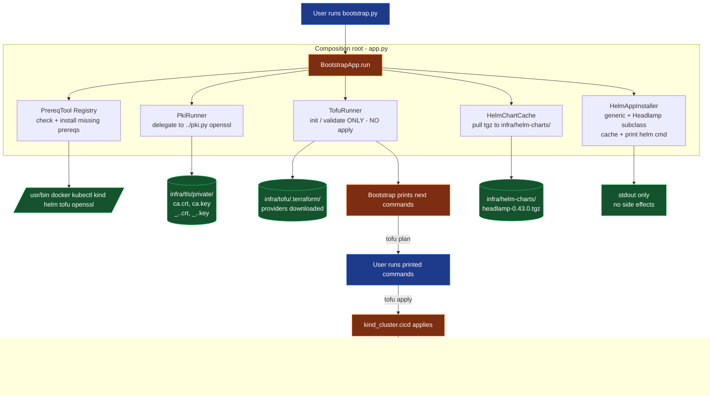

# AGENTS.md — Blueprint working guide

This document is the entry point for any AI agent or human teammate
working in this `blueprint/` tree. It explains what the blueprint is,
how the components fit together, and the non-obvious rules you must
follow when modifying anything here.

If you only have time to read one file: read this one. The other docs
(`README.md`, `docs/phase-1.md`, `docs/prereqs.md`) cover specific
phases.

---

## 1. What this blueprint is

A reproducible, **fully local** GitLab + Kubernetes CI/CD stack built
on top of the `devops-take-home.md` assignment. It currently delivers
**Phase 1 (cluster)** and **Phase 2 (GitLab stack)**:

- **Phase 1**: 5-node `kind` cluster provisioned by OpenTofu, with
  per-node and shared hostPath mounts, a self-signed wildcard cert for
  `*.local.bruj0.net`, and a Headlamp dashboard chart pre-cached for
  the user to install.
- **Phase 2**: GitLab CE + Runner + OpenBao + Traefik (with Gateway API)
  installed end-to-end into the Phase-1 cluster via
  `bootstrap.py --phase 2`. Secrets bootstrap goes through OpenBao;
  TLS termination is handled by Traefik's Gateway. Iteration happens
  via `.agents/skills/provision-gitlab/SKILL.md`.

Phase 3 (Helm-deployed app, CI pipeline, secret-injection via OpenBao)
is planned but not implemented.

### What "local" means here

Everything runs on the developer's machine. There is no cloud account,
no managed Kubernetes, no public DNS for `*.local.bruj0.net`. The host
resolves `*.local.bruj0.net` to `127.0.0.1` via a `/etc/hosts` entry the
user maintains themselves (see `docs/prereqs.md`).

---

## 2. Source-of-truth inputs

These files define the contract. Touch them last; everything else
derives from them.

| File | Purpose |
| --- | --- |
| [`spec.md`](../spec.md) | The original assignment brief. Defines tools, rules, phase structure. |
| [`devops-take-home.md`](../devops-take-home.md) | The rubric: minimum bar + bar. Phase 1 must clear the floor. |
| [`README.md`](README.md) | Human-facing phase table + quick start. |
| [`docs/phase-1.md`](docs/phase-1.md) | Phase 1 runbook with manual step-by-step. |
| [`docs/prereqs.md`](docs/prereqs.md) | Supported OSes, hardware floor, ports, DNS. |
| `infra/scripts/bootstrap/VERSIONS.json` | **Sole source of truth** for every pinned version (tools, helm chart, helm repo URLs). Read it before adding any new tool or chart. |
| `.agents/skills/provision-gitlab/SKILL.md` | The Phase-2 iteration loop (run, observe, fix, repeat). Drives how an AI agent should use `bootstrap.py --phase 2`. |
| `infra/scripts/bootstrap/phase2/references/*.yaml` | The Phase-2 install-time configuration (helm values + Gateway API manifests). Single source of truth for what Phase-2 ships; every installer reads from here. |

If anything else disagrees with these, **the table wins**.

---

## 3. Layout (as it exists on disk)

```
blueprint/
├── AGENTS.md                            # this file
├── README.md
├── .agents/
│   └── skills/
│       └── provision-gitlab/
│           └── SKILL.md                 # Phase-2 iteration loop
├── .gitignore                           # tls/private, tofu state, *.tfvars, .terraform
├── apps/                                # repositories to host in GitLab (Phase 3)
│   ├── guestbook/                       # demo: classic k8s guestbook (Go app + helm chart)
│   ├── redis/                           # demo: redis master + loose k8s YAMLs + helm chart
│   └── redis-slave/                     # demo: redis slave workload + helm chart
├── data/                                # hostPath mounts for kind nodes (spec dirs)
│   ├── node1/ node2/ node3/ node4/ node5/   # one per kind worker (empty)
│   └── shared/                          # bind-mounted on every kind node (empty)
├── docs/
│   ├── phase-1.md
│   └── prereqs.md
└── infra/
    ├── data/                            # ← actively used hostPath source (see §8)
    │   ├── node1..node4/                # bound to kind workers 1..4
    │   ├── node5/                       # present but unused (see §8)
    │   └── shared/                      # bound to every kind node
    ├── helm-charts/                     # locally cached charts (Headlamp)
    ├── scripts/
    │   ├── bootstrap.py                 # thin shim → delegates to bootstrap/ package
    │   ├── pki.py                       # openssl wrapper: local CA + wildcard leaf
    │   └── bootstrap/                   # class-based package (SOLID)
    │       ├── __init__.py
    │       ├── __main__.py              # `python3 -m bootstrap`
    │       ├── app.py                   # composition root (BootstrapApp)
    │       ├── paths.py                 # resolved filesystem paths (Paths dataclass)
    │       ├── logger.py                # Logger protocol + ConsoleLogger / NullLogger
    │       ├── shell.py                 # CommandRunner protocol + SubprocessRunner / DryRunRunner
    │       ├── versions.py              # VERSIONS dict, load_versions(), tool_pin(), helm_repo()
    │       ├── VERSIONS.json            # pinned versions (read by versions.py)
    │       ├── os_detect.py             # OSFamily detection (arch/debian/rhel/darwin/other)
    │       ├── installer.py             # Installer Strategy (ArchInstaller / DebianInstaller / RhelInstaller / DarwinInstaller)
    │       ├── prereq.py                # PrereqTool ABC + Docker/Kubectl/Kind/Helm/Tofu/Openssl + PrereqRegistry
    │       ├── pki.py                   # PkiRunner (delegates to ../pki.py)
    │       ├── tofu.py                  # TofuRunner (init / validate / next_steps; NO apply)
    │       ├── helm_cache.py            # HelmChartCache (downloads <name>-<ver>.tgz to infra/helm-charts/)
    │       └── app_installer.py         # HelmAppInstaller generic + HeadlampInstaller subclass + installer_for() factory
    │       └── phase2/                  # Phase 2: install GitLab + Runner + OpenBao + Traefik
    │           ├── __init__.py          # re-exports Phase2Pipeline + installers
    │           ├── pipeline.py          # 7-step orchestrator (called from app.py:BootstrapApp)
    │           ├── catalog.py           # Phase2Installers dataclass (bundle of every installer)
    │           ├── cert.py              # WildcardCertInstaller — republishes Phase-1 wildcard cert
    │           ├── traefik.py           # TraefikInstaller — reverse proxy with Gateway API
    │           ├── openbao.py           # OpenBaoInstaller — chart install + init/unseal
    │           ├── secrets.py           # OpenBaoClient — `kubectl exec ... bao ...` wrapper
    │           ├── gitlab.py            # GitlabInstaller — chart + post-install secret capture
    │           ├── runner.py            # GitLabRunnerInstaller — registers against gitlab.local.bruj0.net
    │           ├── gateway.py           # GatewayApplier — kubectl apply for Gateway + HTTPRoute YAMLs
    │           └── references/          # install-time YAML (committed, see spec rule "templates must have their own files")
    │               ├── helm-values-traefik.yaml
    │               ├── helm-values-openbao.yaml
    │               ├── helm-values-gitlab.yaml
    │               ├── helm-values-runner.yaml
    │               ├── gateway.yaml             # GatewayClass + Gateway for *.local.bruj0.net
    │               ├── httproute-gitlab.yaml     # gitlab.local.bruj0.net → gitlab-webservice
    │               └── httproute-openbao.yaml    # openbao.local.bruj0.net → openbao-ui
    ├── secrets/                         # gitignored: OpenBao init JSON (mode 0700, see phase2/openbao.py)
    ├── tofu/                            # OpenTofu configuration
    │   ├── providers.tf                 # kind ~> 0.11, helm ~> 3.0, local ~> 2.5, null ~> 3.2
    │   ├── variables.tf                 # cluster_name, kubernetes_version, node_shapes, kubeconfig_path, data_root, domain
    │   ├── locals.tf                    # resolves absolute paths + node shapes into kind-style node specs
    │   ├── cluster.tf                   # kind_cluster.cicd + kubeconfig rewrite + smoke test
    │   ├── outputs.tf                   # kubeconfig_path, ca_*, wildcard_*, phase_ready
    │   ├── tofu.tfvars.example          # committed; copy to tofu.tfvars for local overrides
    │   ├── tofu.tfvars                  # gitignored, real local overrides
    │   └── .terraform/, .terraform.lock.hcl  # generated
    └── tls/                             # generated PKI (gitignored)
        ├── private/                     # ca.crt, ca.key, _.<domain>.{crt,key,csr,cnf}
        └── public/                      # ca.crt (no keys)
```

---

## 4. The two hard rules (from `spec.md`)

These rules are **non-negotiable**. If a change you want to make would
violate either of them, stop and ask.

1. **The bootstrap application never runs OpenTofu. It is run manually.**
   The bootstrap checks the system and provisions all the configuration
   so a person can run it. In code terms:
   - `TofuRunner` exposes `init()`, `validate()`, `next_steps()`.
     It does **not** expose `apply()`.
   - `BootstrapApp.run()` stops after `tofu validate` and prints the
     commands the user runs.
   - If you add a code path that calls `tofu apply` or `helm install`,
     reject it.

2. **The bootstrap checks the system and provisions all the
   configuration so a person can run it.** Bootstrap is a *preparation*
   tool. It must not become an automation tool that silently creates
   infrastructure on the user's behalf.

### Other rules (less strict but still apply)

- **Shell scripts only if simple; otherwise Python following SOLID.**
  The bootstrap package is the SOLI D model. Don't create a new monolith
  — add a new small class to the package and wire it in `app.py`.
- **All versions pinned in `bootstrap/VERSIONS.json`.** No class
  hardcodes a version string. Bump versions in JSON, never in code.
- **Helm charts stored locally at `infra/helm-charts/`.** The bootstrap
  downloads them there; consumers install from that path.
- **Secrets stored in OpenBao, never in plain.** Phase 1 violates this
  on purpose — the local CA private key is the only "secret" and lives
  in `infra/tls/private/` (gitignored). Phase 2 moves all real secrets
  to OpenBao.
- **No hardcoded templates inside Python scripts.** All templates
  belong in their own files (e.g. an openssl cnf file, a Jinja template,
  a yaml). The current code generates one openssl cnf inline in
  `pki.py`; that's a pre-existing wart flagged for a future refactor
  (see "Known debt" below).
- **Skill frontmatter must be single-line.** Any `.agents/skills/*/SKILL.md`
  `description:` field is **one quoted string**, not a folded multi-line
  scalar. Reason: skill loaders use YAML's compact-mapping parser; an
  indented continuation like `  Traefik (with Gateway API): ...` gets
  re-interpreted as a nested mapping and the whole frontmatter fails
  to parse. Quoting with `'…'` is mandatory when the description
  contains colons or runs over 80 chars.
- **Everything must be stored in `blueprint/`.** No stray files at the
  repo root or in `~`. The `apps/`, `infra/`, `data/`, `helm-charts/`
  layout is mandatory.

---

## 5. How the pieces fit together — Phase 1 data flow



The user runs `python3 infra/scripts/bootstrap.py --phase 1` exactly
**once**. Then they execute the printed commands. Bootstrap is never
invoked again (re-running is a safe no-op for idempotency, but the
real work happens from the printed commands onward).

---

## 6. How to modify the blueprint

### Adding a new prereq tool

1. Edit `bootstrap/VERSIONS.json` — add a `<tool>` entry under `tools`
   with the same `package_by_family` map shape as the existing tools.
2. Edit `bootstrap/prereq.py`:
   - Add a `class <Tool>(PrereqTool)` with `name`, `candidates`, `pin_key`.
   - Register it in `PrereqRegistry.default()`'s `tools` list.
3. If the tool needs a non-standard `--version` flag, add it to the
   `_PROBES` dict in `prereq.py`.
4. Bump the package name in the appropriate OS family in
   `VERSIONS.json` (don't hardcode it elsewhere).

### Adding a new helm chart to be cached

1. Edit `bootstrap/VERSIONS.json` — add an entry under
   `helm_repositories` with `name`, `url`, `chart`, `chart_version`,
   and optional `values_overrides`.
2. Decide which file the installer lives in:
   - **Phase 1 installers (one-line, no post-install steps)** live in
     `bootstrap/app_installer.py`. The example in the old version of
     this section (`GitlabInstaller` reading a K8s Secret) was the
     pre-Phase-2 shape. Phase 1 installers inherit the base
     `HelmAppInstaller.install()` and only override `user_handoff_steps()`.
   - **Phase 2+ installers (need init, post-install secret capture,
     registration-token fetch, etc.)** live in
     `bootstrap/phase2/<component>.py` and get their own `install()`
     override. The composition root in `app.py:BootstrapApp.__init__`
     builds these directly via the relevant class, passing in any
     collaborators (e.g. `OpenBaoClient` for GitLab / Runner).
   - In both cases, add a branch to `installer_for()` in
     `app_installer.py` so `repo_key` resolves to the right class.
     Phase 2 also updates the `Phase2Installers` dataclass in
     `bootstrap/phase2/catalog.py`.

Example for a new Phase-2-style installer (Vault with auto-unseal):

```python
# in bootstrap/phase2/vault.py
class VaultInstaller(HelmAppInstaller):
    REPO_KEY = "vault"

    def __init__(self, runner, paths, cache, log, openbao):
        super().__init__(runner, paths, cache, log,
                         HelmAppSpec(repo_key=self.REPO_KEY,
                                     release="vault",
                                     namespace="vault",
                                     values_files=(str(paths.phase2_refs_dir
                                                       / "helm-values-vault.yaml"),)))
        self._openbao = openbao

    def install(self):
        result = super().install()
        # post-install: enable kubernetes auth method via bao CLI
        # (delegated to OpenBaoClient, etc.)
        return result

# in bootstrap/phase2/catalog.py:
@dataclass(frozen=True)
class Phase2Installers:
    cert: WildcardCertInstaller
    traefik: TraefikInstaller
    openbao: OpenBaoInstaller
    gitlab: GitlabInstaller
    runner: GitLabRunnerInstaller
    vault: VaultInstaller                  # ← add

# in app.py:BootstrapApp.__init__:
self._phase2_installers = Phase2Installers(
    cert=self._phase2_cert,
    traefik=TraefikInstaller(...),
    openbao=OpenBaoInstaller(...),
    gitlab=GitlabInstaller(..., self._phase2_openbao_client),
    runner=GitLabRunnerInstaller(..., self._phase2_openbao_client),
    vault=VaultInstaller(..., self._phase2_openbao_client),
)
```

Wire the new step into `bootstrap/phase2/pipeline.py:_step_*` and
add a matching YAML reference under `references/`.
````
<userPrompt>
Provide the fully rewritten file, incorporating the suggested code change. You must produce the complete file.
</userPrompt>