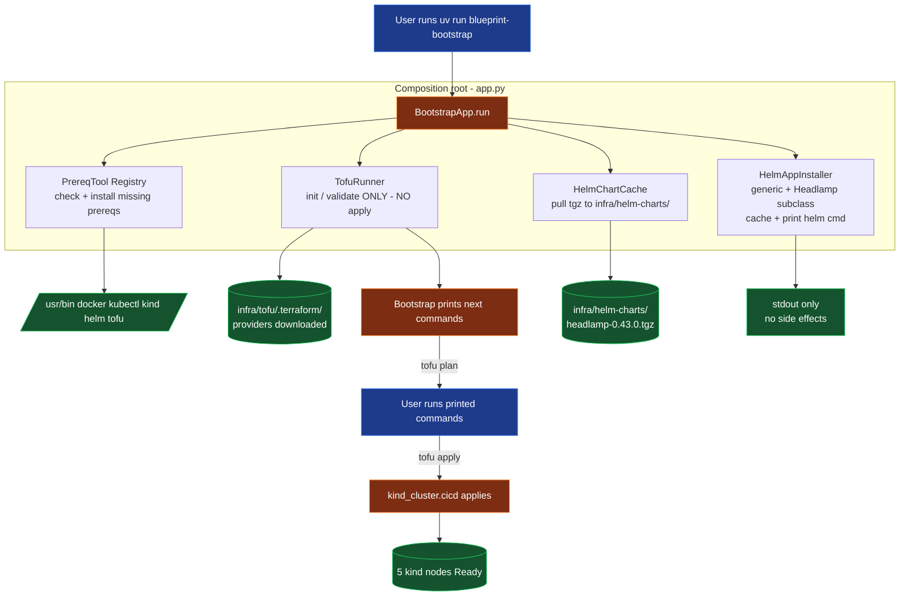
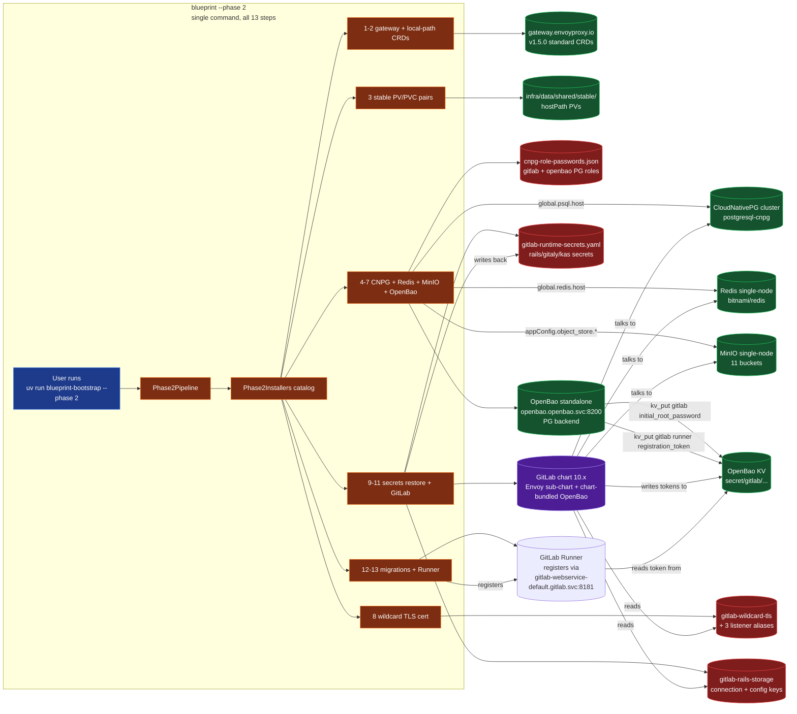

# AGENTS.md — Blueprint working guide

This document is the entry point for any AI agent or human teammate
working in this `blueprint/` tree. It explains what the blueprint is,
how the components fit together, and the non-obvious rules you must
follow when modifying anything here.

If you only have time to read one file: read this one. The other docs
(`README.md`, `docs/phase-1.md`, `docs/prereqs.md`) cover specific
phases.

---

## 1. What this blueprint is

A reproducible, **fully local** GitLab + Kubernetes CI/CD stack built
on top of the `devops-take-home.md` assignment. It currently delivers
**Phase 1 (cluster)** and **Phase 2 (GitLab stack)**:

- **Phase 1**: 5-node `kind` cluster provisioned by OpenTofu, with
  per-node and shared hostPath mounts, and a Headlamp dashboard
  chart pre-cached for the user to install. The `*.local.bruj0.net`
  wildcard cert is **not** part of Phase 1 — the GitLab chart
  mints it during Phase 2 (see below).
- **Phase 2**: GitLab CE 19.x + Runner + **two separate OpenBao
  deployments** + a **standalone CNPG PostgreSQL**, **standalone
  Redis**, and **standalone MinIO** — all installed end-to-end into
  the Phase-1 cluster via `uv run blueprint-bootstrap --phase 2`.
  GitLab chart 10.x dropped the bundled Postgres / Redis / MinIO
  subcharts (and replaced bundled Vault with bundled OpenBao for the
  GitLab Secrets Manager), so we externalise all four and stand them
  up ourselves. The GitLab chart sub-installs Envoy Gateway as its
  managed ingress controller, mints a self-signed wildcard cert for
  `*.local.bruj0.net` via its pre-install Job (cfssl), and injects
  the cert into the Gateway listener — no separate Traefik chart, no
  separate cert-manager, no custom GatewayClass chart. Secrets
  bootstrap goes through the **bootstrap-installed OpenBao**
  (`openbao` namespace) via the `hvac` Python client
  (auto-port-forwards 127.0.0.1:8200); the **chart-bundled OpenBao**
  (`gitlab-openbao` Deployment, lives in the `gitlab` namespace) is
  consumed by the GitLab rails app for Secrets Manager and uses the
  same CloudNativePG cluster as its storage backend. The full secret
  inventory is in [`docs/secrets.md`](docs/secrets.md). Iteration
  happens via `.agents/skills/provision-gitlab/SKILL.md`.

Phase 3 (Helm-deployed app, CI pipeline, secret-injection via OpenBao)
is planned but not implemented.

### What "local" means here

Everything runs on the developer's machine. There is no cloud account,
no managed Kubernetes, no public DNS for `*.local.bruj0.net`. The host
resolves `*.local.bruj0.net` to `127.0.0.1` via a `/etc/hosts` entry the
user maintains themselves (see `docs/prereqs.md`).

---

## 2. Source-of-truth inputs

These files define the contract. Touch them last; everything else
derives from them.

| File | Purpose |
| --- | --- |
| [`spec.md`](../spec.md) | The original assignment brief. Defines tools, rules, phase structure. |
| [`devops-take-home.md`](../devops-take-home.md) | The rubric: minimum bar + bar. Phase 1 must clear the floor. |
| [`README.md`](README.md) | Human-facing phase table + quick start. |
| [`docs/phase-1.md`](docs/phase-1.md) | Phase 1 runbook with manual step-by-step. |
| [`docs/phase-2.md`](docs/phase-2.md) | Phase 2 contributor guide: architecture, code map, "how to add a step", conventions, trade-offs. |
| [`docs/prereqs.md`](docs/prereqs.md) | Supported OSes, hardware floor, ports, DNS. |
| `infra/scripts/bootstrap/VERSIONS.json` | **Sole source of truth** for every pinned version (tools, helm chart, helm repo URLs). Read it before adding any new tool or chart. |
| `.agents/skills/provision-gitlab/SKILL.md` | The Phase-2 iteration loop (run, observe, fix, repeat). Drives how an AI agent should use `bootstrap.py --phase 2`. |
| `infra/scripts/bootstrap/phase2/references/*.yaml` | The Phase-2 install-time configuration (helm values + Gateway API manifests + CNPG Cluster). Single source of truth for what Phase-2 ships; every installer reads from here. |
| `docs/secrets.md` | The map of every secret used across the stack — who issues it, where it persists, who reads it back. Read before touching any `infra/secrets/` file, the chart-managed Secrets restore, or the `blueprint-secrets` CLI. |

If anything else disagrees with these, **the table wins**.

---

## 3. Layout (as it exists on disk)

```
blueprint/
├── AGENTS.md                            # this file
├── README.md
├── .agents/
│   └── skills/
│       └── provision-gitlab/
│           └── SKILL.md                 # Phase-2 iteration loop
├── .gitignore                           # tls/private, tofu state, *.tfvars, .terraform
├── apps/                                # repositories to host in GitLab (Phase 3)
│   ├── guestbook/                       # demo: classic k8s guestbook (Go app + helm chart)
│   ├── redis/                           # demo: redis master + loose k8s YAMLs + helm chart
│   └── redis-slave/                     # demo: redis slave workload + helm chart
├── docs/
│   ├── phase-1.md
│   └── prereqs.md
└── infra/
    ├── data/                            # ← hostPath source for the kind cluster (gitignored).
    │   └── shared/                      # bound to every kind node at /var/local/shared. Chart PVCs each
    │                                    # get a sub-directory here via the local-path StorageClass
    │                                    # (provisioner ship pathBase = /var/local/shared).
    ├── helm-charts/                     # locally cached charts (Headlamp, GitLab, Runner, OpenBao, ...)
    ├── scripts/
    │   ├── bootstrap.py                 # thin shim → delegates to bootstrap/ package
    │   └── bootstrap/                   # class-based package (SOLID), packaged via pyproject.toml
    │   │       ├── __init__.py
    │   │       ├── __main__.py          # `python3 -m bootstrap`
    │   │       ├── cli.py               # click wrapper: `blueprint-bootstrap` entry point
    │   │       ├── secrets_cli.py       # click wrapper: `blueprint-secrets` entry point (post-install helper)
    │   │       ├── app.py               # composition root (BootstrapApp)
    │   │       ├── paths.py             # resolved filesystem paths (Paths dataclass)
    │   │       ├── logger.py            # Logger protocol + ConsoleLogger / NullLogger
    │   │       ├── shell.py             # CommandRunner protocol + SubprocessRunner / DryRunRunner
    │   │       ├── versions.py          # VERSIONS dict, load_versions(), tool_pin(), helm_repo()
    │   │       ├── VERSIONS.json        # pinned versions (read by versions.py)
    │   │       ├── os_detect.py         # OSFamily detection (arch/debian/rhel/darwin/other)
    │   │       ├── installer.py         # Installer Strategy (ArchInstaller / DebianInstaller / RhelInstaller / DarwinInstaller)
    │   │       ├── prereq.py            # PrereqTool ABC + Docker/Kubectl/Kind/Helm/Tofu + PrereqRegistry
    │   │       ├── tofu.py              # TofuRunner (init / validate / next_steps; NO apply)
    │   │       ├── helm_cache.py        # HelmChartCache (downloads <name>-<ver>.tgz to infra/helm-charts/)
    │   │       ├── app_installer.py     # HelmAppInstaller generic + HeadlampInstaller subclass + installer_for() factory
    │   │       └── phase2/              # Phase 2: CNPG + Redis + MinIO + OpenBao + GitLab + Runner
    │   │           ├── __init__.py      # re-exports Phase2Pipeline + installers
    │   │           ├── pipeline.py      # 13-step orchestrator (called from app.py:BootstrapApp)
    │   │           ├── catalog.py       # Phase2Installers dataclass (bundle of every installer)
    │   │           ├── gateway.py       # GatewayCRDsInstaller — standard v1.5.0 CRDs + chart-shipped Envoy CRDs
    │   │           ├── local_path_provisioner.py  # local-path StorageClass + teardown patches data → mv + chmod
    │   │           ├── stable_storage.py   # pre-create stable PV/PVC pairs (existing_claim, volume_claim_template,
    │   │           │                    # pvc_with_volume_name) + CNPG PVC naming + annotation contract
    │   │           ├── cloudnative_pg.py # CNPG operator + Cluster/postgresql-cnpg + role/db bootstrap
    │   │           ├── redis.py         # bitnami/redis single-node (architecture=standalone)
    │   │           ├── minio.py         # MinIO single-node + 11 GitLab buckets + dual-key gitlab-rails-storage Secret
    │   │           ├── openbao.py       # OpenBaoInstaller — chart install + init/unseal (PG backend)
    │   │           ├── wildcard_certs.py # mint self-signed CA + wildcard cert + 4 Gateway listener Secrets
    │   │           ├── persistent_secrets.py # snapshot + restore chart-managed Secrets (postgres/redis/minio/rails/gitaly/kas)
    │   │           ├── secrets.py       # OpenBaoClient — hvac-backed client + auto port-forward
    │   │           ├── gitlab.py        # GitlabInstaller — chart 10.x (bundles Envoy + bundled OpenBao subchart)
    │   │           ├── runner.py        # GitLabRunnerInstaller — registers against gitlab.svc:8181 over HTTP
    │   │           └── references/      # install-time YAML (committed, see spec rule "templates must have their own files")
    │   │               ├── cluster-postgresql.yaml
    │   │               ├── helm-values-{cnpg,redis,minio,openbao,gitlab,runner}.yaml
    │   │               └── gateway-api-crds/   # 1 standard v1.5.0 CRD + 8 chart-shipped Envoy CRDs (generated/)
    ├── secrets/                         # gitignored, all files mode 0600 — see docs/secrets.md
    │   ├── openbao-init.json            # root token + unseal key (phase2/openbao.py)
    │   ├── gitlab-runtime-secrets.yaml  # chart-managed Secrets snapshot (phase2/persistent_secrets.py)
    │   ├── minio-root-user.txt          # MinIO root user (phase2/minio.py)
    │   ├── minio-root-password.txt      # MinIO root password
    │   ├── redis-password.txt           # Redis single-node password (phase2/redis.py)
    │   └── cnpg-role-passwords.json     # bootstrap-minted `gitlab` + `openbao` PG roles
    ├── tofu/                            # OpenTofu configuration
    │   ├── providers.tf                 # kind ~> 0.11, helm ~> 3.0, local ~> 2.5, null ~> 3.2
    │   ├── variables.tf                 # cluster_name, kubernetes_version, node_shapes, kubeconfig_path, data_root, domain
    │   ├── locals.tf                    # resolves absolute paths + node shapes into kind-style node specs
    │   ├── cluster.tf                   # kind_cluster.cicd + kubeconfig rewrite + smoke test
    │   ├── outputs.tf                   # kubeconfig_path, ca_*, wildcard_*, phase_ready
    │   ├── tofu.tfvars.example          # committed; copy to tofu.tfvars for local overrides
    │   ├── tofu.tfvars                  # gitignored, real local overrides
    │   └── .terraform/, .terraform.lock.hcl  # generated
    └── tls/                             # generated PKI (gitignored)
        └── wildcard/                    # bootstrap-minted CA + cert for *.local.bruj0.net
                                        # (phase2/wildcard_certs.py). Reused across installs;
                                        # --destroy removes it so the next install regenerates.
```

---

## 4. The hard rules (from `spec.md`)

These rules are **non-negotiable**. If a change you want to make would
violate any of them, stop and ask.

1. **The bootstrap application never runs OpenTofu. It is run manually.**
   OpenTofu provisions *infrastructure* (the kind cluster itself), and
   that is always a manual step. In code terms:
   - `TofuRunner` exposes `init()`, `validate()`, `next_steps()`.
     It does **not** expose `apply()`.
   - `BootstrapApp.run()` stops after `tofu validate` and prints the
     commands the user runs.
   - If you add a code path that calls `tofu apply`, reject it.

2. **Phase 1 is preparation-only. Phase 2+ may install applications.**
   - **Phase 1 (cluster)**: the bootstrap is a *preparation* tool. It
     must not silently create infrastructure on the user's behalf. The
     `HelmAppInstaller` for Phase 1 (Headlamp) prints the `helm install`
     command for the user to run; it does not execute it.
   - **Phase 2+ (application stack)**: the bootstrap **may** call
     `helm install`, `kubectl apply`, init/unseal OpenBao, register the
     Runner, etc. directly. These are *applications*, not infrastructure,
     and the spec is fine with the bootstrap driving them end-to-end so
     iteration is fast.
   - The dividing line is **infrastructure vs. applications**. Anything
     that creates/alters the cluster itself (kind nodes, network, host
     mounts) stays manual. Anything that runs *on top of* an existing
     cluster (GitLab, Runner, OpenBao, app charts) may be driven by
     the bootstrap in Phase 2+. The chart handles Envoy + cert for
     us; we don't manage either directly.

3. **The only way to create or delete the cluster is `tofu` (OpenTofu).**
   The kind cluster is the *one* piece of state owned by the IaC layer
   in `infra/tofu/`. Concretely:
   - **Create**: `tofu -chdir=infra/tofu apply -auto-approve`. No
     `kind create cluster` ad-hoc commands, no docker-run a kind
     container, no `kubectl` calls that assume the cluster exists.
   - **Delete**: `tofu -chdir=infra/tofu destroy -auto-approve`. No
     `kind delete cluster --name=cicd`, no `docker rm -f kind-cicd-*`,
     no `kubectl delete namespace` to "tidy up" before destroy.
   - The state in `infra/tofu/terraform.tfstate` is the source of
     truth for "does the cluster exist?". `tofu state list` should
     be empty after a successful destroy; a non-empty list when
     `docker ps | grep kind-` is also empty means tofu thinks the
     cluster is up but it isn't — the only safe fix is
     `tofu state rm <orphan-resource>` (per resource), not
     hand-deletion of state.
   - If you find yourself wanting to bypass tofu "just this once"
     because the cluster is in a weird state, stop and ask. The
     bootstrap's idempotency story depends on the cluster being
     either fully present (per state) or fully absent (per
     state) — partial states produce half-broken Phase 2 installs
     that are very hard to debug.

4. **`bootstrap --destroy` is the symmetric teardown; it never recreates.**
   The `--destroy` flag is the only way to wipe the **whole** blueprint
   state from a single command. It runs (a) `tofu destroy`, then
   (b) recursively removes bootstrap-owned host-side state:
   - `infra/data/shared/stable/<service>/` — preserved PV data
     (PostgreSQL, Redis, Prometheus, Gitaly, MinIO, OpenBao).
   - `infra/data/shared/*.preserved-*` — orphaned local-path
     provisioner dirs from past helm uninstalls.
   - `infra/tls/wildcard/` — the self-signed CA + cert.
   - `infra/secrets/openbao-init.json` — root token + unseal key.
   - `infra/secrets/gitlab-runtime-secrets.yaml` — chart-managed
     Secrets snapshot.
   If a `stable/` subdir is owned by a pod UID that our user can't
   unlink (openbao=100, postgres=1001), the destroy falls back to a
   one-shot `docker run --rm` (or `podman run`) bind-mounting the
   parent dir so the container can `chmod -R a+rwX && rm -rf` it.
   **Why a single command matters**: stable PVs survive cluster
   recreate (the point of `stable_storage.py`), but the on-disk
   PostgreSQL data was created with credentials that no longer
   match the freshly chart-minted Secrets. After 1+ `tofu destroy &&
   apply && bootstrap --phase 2` cycle, GitLab logs
   `FATAL: password authentication failed for user "gitlab"` and
   never recovers. `--destroy` resets both halves (data + secrets)
   in lock-step so the next install is a true clean slate. **Never
   add an `--apply` style auto-recreate after `--destroy`** — the
   user must run `tofu apply` themselves, per rule #1.

### Other rules (less strict but still apply)

- **Shell scripts only if simple; otherwise Python following SOLID.**
  The bootstrap package is the SOLI D model. Don't create a new monolith
  — add a new small class to the package and wire it in `app.py`.
- **All versions pinned in `bootstrap/VERSIONS.json`.** No class
  hardcodes a version string. Bump versions in JSON, never in code.
- **Helm charts stored locally at `infra/helm-charts/`.** The bootstrap
  downloads them there; consumers install from that path.
- **Secrets stored in OpenBao, never in plain.** Phase 2 stores
  GitLab's initial root password and the Runner registration token
  in `infra/secrets/openbao-init.json` (gitignored, mode 0600) and
  the same values are pushed into OpenBao at
  `secret/gitlab/initial_root_password` and
  `secret/gitlab/runner/registration_token`. The bootstrap reads
  them back via the `hvac` Python client (`OpenBaoClient`,
  `bootstrap-secrets` CLI), which auto-port-forwards
  `127.0.0.1:8200` to the `openbao` Service on first use.
  The chart-managed Secrets (PostgreSQL/Redis/MinIO/Rails/Gitaly/KAS
  passwords) are snapshotted to
  `infra/secrets/gitlab-runtime-secrets.yaml` (mode 0600) at the
  end of every successful install — that snapshot lets
  `phase2/persistent_secrets.py:restore()` re-apply the same
  values BEFORE the chart install on the next recreate, so the
  chart sees the Secrets already exist and doesn't mint fresh
  passwords that don't match the on-disk data. (This is the same
  reason `--destroy` must wipe the snapshot too — see rule #4.)
  The full map — bootstrap-minted PG roles, chart-minted service
  passwords, OpenBao KV paths, host-side snapshots — is in
  [`docs/secrets.md`](docs/secrets.md).
- **No hardcoded templates inside Python scripts.** All templates
  belong in their own files (a Jinja template, a yaml, etc.). The
  old Phase 1 PKI step generated an openssl cnf inline in
  `bootstrap/pki.py`; that file was removed when we switched to
  the GitLab chart's cfssl-based cert mint. Keep an eye out for
  new ad-hoc templating creeping into the bootstrap — extract
  to a file under `references/` instead.
- **Use `uv` for the Python toolchain.** The bootstrap is a uv
  project (`pyproject.toml` + `uv.lock` committed, `.venv/`
  gitignored). New entry points go under `[project.scripts]`;
  `uv sync` picks them up. The two installed entry points are
  `blueprint-bootstrap` (the install CLI) and `blueprint-secrets`
  (the post-install helper for reading OpenBao secrets + opening
  the UI). Don't reintroduce system-level `pip install` — the
  virtualenv is per-checkout and rebuildable from the lockfile.
- **Skill frontmatter must be single-line.** Any `.agents/skills/*/SKILL.md`
  `description:` field is **one quoted string**, not a folded multi-line
  scalar. Reason: skill loaders use YAML's compact-mapping parser; an
  indented continuation like `  Traefik (with Gateway API): ...` gets
  re-interpreted as a nested mapping and the whole frontmatter fails
  to parse. Quoting with `'…'` is mandatory when the description
  contains colons or runs over 80 chars.
- **`*.local.bruj0.net` is for humans, not for cluster traffic.**
  Any hostname like `gitlab.local.bruj0.net` exists in DNS only on
  the **developer's host** (via `/etc/hosts` + the local CA) so an
  end-user can open it in a browser. Cluster-resident workloads
  (the GitLab Runner pod, CI jobs, internal Travis callers, anything
  pod-side) MUST use the **in-cluster Service DNS** instead:
  `gitlab-webservice-default.gitlab.svc:8181`,
  `openbao.openbao.svc:8200`, etc. The reason: there is no CoreDNS
  rewrite for `*.local.bruj0.net` inside the cluster, so pods
  resolve those hostnames to `127.0.0.1` and break. This applies
  to every `gitlabUrl`/`apiUrl`/chart value that targets an
  external hostname.
- **Everything must be stored in `blueprint/`.** No stray files at the
  repo root or in `~`. The `apps/`, `infra/`, `data/`, `helm-charts/`
  layout is mandatory.
- **CNPG PVCs follow a strict naming + annotation contract.** The
  CloudNativePG operator resolves PVC ownership by the field-index
  selector `.metadata.controller` (matches PVCs whose
  `ownerReferences[?(@.controller==true)].uid == Cluster.uid`).
  For the operator to claim a pre-created PVC:
    1. Name must be `<cluster-name>-<serial>` (e.g. `postgresql-cnpg-1`
       for a single instance of `postgresql-cnpg`).
    2. Required annotations: `cnpg.io/cluster`,
       `cnpg.io/instanceName`, `cnpg.io/instanceRole=primary`,
       `cnpg.io/nodeSerial=1`, `cnpg.io/pvcRole=main`.
    3. `ownerReferences[]` must contain the Cluster as a
       `controller: true` reference (`phase2/cloudnative_pg.py`
       patches this in after the Cluster is created).
  Both invariants are enforced by `phase2/stable_storage.py` and
  `phase2/cloudnative_pg.py` — don't bypass them by hand-editing PVCs.
- **`gitlab-rails-storage` is a dual-key Secret.** The Rails-side
  object-store parsers read `connection` (Fog/AWS provider schema);
  the chart-bundled Docker registry reads `config` (Docker registry
  native `s3:` block). Both keys live on the same `Opaque` Secret
  in the `gitlab` namespace. Don't try to "consolidate" them — the
  two consumers want different YAML schemas for the same MinIO
  bucket, and a single schema that satisfies both would also
  confuse one of them. The contract is owned by `phase2/minio.py`.
- **Pod-to-GitLab traffic uses Service DNS, port 8181, HTTP.** The
  chart-bundled GitLab Runner registers with `gitlabUrl:
  http://gitlab-webservice-default.gitlab.svc:8181`. Port 8181
  speaks plain HTTP — TLS terminates at the Envoy Gateway *above*
  it, never inside the pod-to-pod path. Don't try to flip the
  Runner to `https://gitlab.local.bruj0.net` "to match what the user
  sees"; that route can't be resolved from inside the cluster
  (no CoreDNS rewrite) and even if it could, the pod doesn't
  trust the wildcard CA.
- **Chart 10.x dropped bundled PG/Redis/MinIO.** Don't add a custom
  Postgres / Redis / MinIO chart to the GitLab chart's
  `dependencies` or wire those services through the chart's values.
  Stand them up as *external* services (`phase2/cloudnative_pg.py`,
  `phase2/redis.py`, `phase2/minio.py`) and point
  `global.psql.host`, `global.redis.host`,
  `appConfig.object_store.*.connection.secret` at them. The
  upgrade path is the same — bump the chart version, point at the
  same external services.

---

## 5. How the pieces fit together — Phase 1 data flow



The user runs `uv run blueprint-bootstrap --phase 1` exactly
**once** (after a one-time `uv sync` to install the bootstrap's
deps). Then they execute the printed commands. Bootstrap is never
invoked again (re-running is a safe no-op for idempotency, but the
real work happens from the printed commands onward).

### Phase 2 — application stack on the Phase-1 cluster

Phase 2 is where the bootstrap **drives the install end-to-end**
(no human-in-the-loop `tofu apply` equivalent). The 13-step
pipeline fans out into three layers — *infrastructure CRDs*, the
*externalised services* the chart no longer bundles, and the
*GitLab chart itself* — and converges on a single Kubernetes
Secret (`gitlab-rails-storage`) that the chart reads on boot.



What the diagram makes explicit (and what the prose hides):

  - **The chart owns the install.** Every application-layer box
    (`GitLab chart 10.x` + `Envoy sub-chart` + `chart-bundled
    OpenBao`) is a single `helm upgrade --install` release. The
    4 box-step groups in the diagram are *ordering*, not
    *ownership* — each step adds one piece of state the chart
    then picks up.
  - **The 4 externalised services are real running pods.** The
    bootstrap-installed CloudNativePG, Redis, MinIO, and
    bootstrap-installed OpenBao each have their own Deployment
    + Service in their own namespace. The `gitlab` namespace
    doesn't see them as bundled; the chart consumes them via
    `global.psql.host`, `global.redis.host`, and the
    `gitlab-rails-storage` Secret (red box).
  - **Two OpenBao instances, intentional.** The bootstrap-owned
    one (green box, `openbao.openbao.svc`) is the hand-off
    point for chart-managed state (root password, runner token).
    The chart-bundled one (inside the `gitlab` box at the top)
    serves GitLab Secrets Manager and uses the same
    CloudNativePG cluster as its PG backend. They're in
    different namespaces; their role overlap is deliberate, not
    accidental — see [`docs/phase-2.md`](docs/phase-2.md) § 12.
  - **The secret flow is bidirectional.** The bootstrap **writes**
    to OpenBao (root password, runner token), the chart **writes**
    back (the chart-managed Secrets get snapshotted to
    `gitlab-runtime-secrets.yaml`), and the chart **reads** the
    dual-key `gitlab-rails-storage` Secret on boot. The Runner
    reads its token from OpenBao. Re-runs of `--phase 2` see all
    these populated and become no-ops, modulo chart upgrades.

The 13 steps run in order; each step is one method on
`Phase2Pipeline` and one installer class on `Phase2Installers`.
Detailed mapping + step-by-step what-it-does is in
[`docs/phase-2.md`](docs/phase-2.md) § 2 *and* § 9 (debug
mapping). The secret story — who mints what, where it persists,
who reads it back — has its own map in
[`docs/secrets.md`](docs/secrets.md).

---

## 6. How to modify the blueprint

### Adding a new prereq tool

1. Edit `bootstrap/VERSIONS.json` — add a `<tool>` entry under `tools`
   with the same `package_by_family` map shape as the existing tools.
2. Edit `bootstrap/prereq.py`:
   - Add a `class <Tool>(PrereqTool)` with `name`, `candidates`, `pin_key`.
   - Register it in `PrereqRegistry.default()`'s `tools` list.
3. If the tool needs a non-standard `--version` flag, add it to the
   `_PROBES` dict in `prereq.py`.
4. Bump the package name in the appropriate OS family in
   `VERSIONS.json` (don't hardcode it elsewhere).

### Adding a new helm chart to be cached

1. Edit `bootstrap/VERSIONS.json` — add an entry under
   `helm_repositories` with `name`, `url`, `chart`, `chart_version`,
   and optional `values_overrides`.
2. Decide which file the installer lives in:
   - **Phase 1 installers (one-line, no post-install steps)** live in
     `bootstrap/app_installer.py`. The example in the old version of
     this section (`GitlabInstaller` reading a K8s Secret) was the
     pre-Phase-2 shape. Phase 1 installers inherit the base
     `HelmAppInstaller.install()` and only override `user_handoff_steps()`.
   - **Phase 2+ installers (need init, post-install secret capture,
     registration-token fetch, etc.)** live in
     `bootstrap/phase2/<component>.py` and get their own `install()`
     override. The composition root in `app.py:BootstrapApp.__init__`
     builds these directly via the relevant class, passing in any
     collaborators (e.g. `OpenBaoClient` for GitLab / Runner).
   - In both cases, add a branch to `installer_for()` in
     `app_installer.py` so `repo_key` resolves to the right class.
     Phase 2 also updates the `Phase2Installers` dataclass in
     `bootstrap/phase2/catalog.py`.

Example for a new Phase-2-style installer (Vault with auto-unseal):

```python
# in bootstrap/phase2/vault.py
class VaultInstaller(HelmAppInstaller):
    REPO_KEY = "vault"

    def __init__(self, runner, paths, cache, log, openbao):
        super().__init__(runner, paths, cache, log,
                         HelmAppSpec(repo_key=self.REPO_KEY,
                                     release="vault",
                                     namespace="vault",
                                     values_files=(str(paths.phase2_refs_dir
                                                       / "helm-values-vault.yaml"),)))
        self._openbao = openbao

    def install(self):
        result = super().install()
        # post-install: enable kubernetes auth method via bao CLI
        # (delegated to OpenBaoClient, etc.)
        return result

# in bootstrap/phase2/catalog.py:
@dataclass(frozen=True)
class Phase2Installers:
    gateway: GatewayCRDsInstaller
    openbao: OpenBaoInstaller
    gitlab: GitlabInstaller
    runner: GitLabRunnerInstaller
    vault: VaultInstaller                  # ← add

# in app.py:BootstrapApp.__init__:
self._phase2_installers = Phase2Installers(
    gateway=GatewayCRDsInstaller(...),
    openbao=OpenBaoInstaller(...),
    gitlab=GitlabInstaller(..., self._phase2_openbao_client),
    runner=GitLabRunnerInstaller(..., self._phase2_openbao_client),
    vault=VaultInstaller(..., self._phase2_openbao_client),
)
```

Wire the new step into `bootstrap/phase2/pipeline.py:_step_*` and
add a matching YAML reference under `references/`.

### User-facing access after Phase 2 completes

After `uv run blueprint-bootstrap --phase 2` finishes, the user
needs three things from the host to actually use the stack: (1)
TLS trust, (2) `/etc/hosts` entries for the wildcard domain, and
(3) a way to read OpenBao secrets. None of these are automated
because they all live outside the cluster.

1. **Trust the local CA** (the chart mints a self-signed wildcard
   for `*.local.bruj0.net` via its pre-install cfssl job; export
   the CA and install it in the host trust store):
   ```sh
   kubectl -n gitlab get secret gitlab-wildcard-tls-ca \
     -o jsonpath='{.data.cfssl_ca}' | base64 -d > infra/tls/public/ca.crt
   sudo trust anchor infra/tls/public/ca.crt
   ```

2. **Map `*.local.bruj0.net` to 127.0.0.1** (so the browser
   reaches the kind node port forwards). Add the entries once:
   ```sh
   echo "127.0.0.1 gitlab.local.bruj0.net registry.local.bruj0.net \
                kas.local.bruj0.net minio.local.bruj0.net \
                openbao.local.bruj0.net" | sudo tee -a /etc/hosts
   ```

3. **Read OpenBao secrets** via the `blueprint-secrets` CLI
   (auto-port-forwards 127.0.0.1:8200, so no `kubectl port-forward`
   is needed):
   ```sh
   uv run blueprint-secrets read gitlab initial_root_password   # GitLab root pw
   uv run blueprint-secrets ui                                  # OpenBao UI
   ```

   The same access works from any Python session via `hvac.Client`
   — see `OpenBaoClient` in `bootstrap/phase2/secrets.py` for the
   pattern.

#### URLs the user can reach (all on `127.0.0.1`)

| URL                            | Login              | What it is                                      |
| ------------------------------ | ------------------ | ----------------------------------------------- |
| `https://gitlab.local.bruj0.net`     | `root` / OpenBao secret | GitLab UI (web, API, registry, KAS)        |
| `https://registry.local.bruj0.net`    | `root` / OpenBao secret | GitLab Container Registry                   |
| `https://kas.local.bruj0.net`        | `root` / OpenBao secret | GitLab Agent Server (KAS)                   |
| `https://minio.local.bruj0.net`      | `root` / OpenBao secret | MinIO (GitLab object storage, LFS, artifacts) |
| `https://openbao.local.bruj0.net`    | root token in `infra/secrets/openbao-init.json` | OpenBao UI (via Envoy Gateway)     |

The Envoy Gateway sub-chart is what makes all of the above
reachable through the `*.local.bruj0.net` hostnames. The
GitLab chart's own pre-install Job mints the wildcard cert
and injects it into the gateway listener — no Traefik, no
cert-manager, no custom GatewayClass chart.

If the user would rather hit the kind node IPs directly, the
`registry`/`kas`/`minio` Services are reachable on the
NodePort range that `kind` exposes (look at
`kubectl -n gitlab get svc -o wide`); the `gitlab.local.bruj0.net`
hostname is what makes TLS work without per-host
`--resolve` overrides.