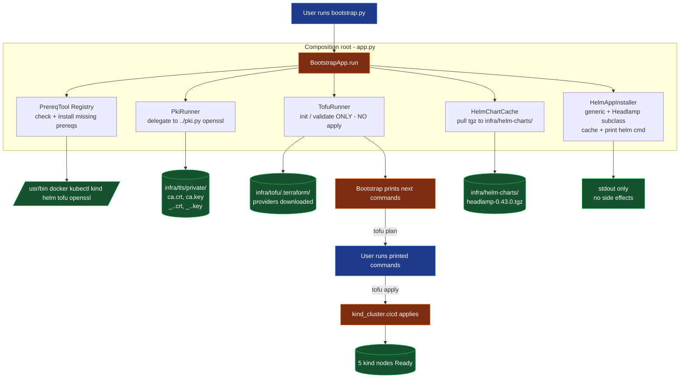

# AGENTS.md — Blueprint working guide

This document is the entry point for any AI agent or human teammate
working in this `blueprint/` tree. It explains what the blueprint is,
how the components fit together, and the non-obvious rules you must
follow when modifying anything here.

If you only have time to read one file: read this one. The other docs
(`README.md`, `docs/phase-1.md`, `docs/prereqs.md`) cover specific
phases.

---

## 1. What this blueprint is

A reproducible, **fully local** GitLab + Kubernetes CI/CD stack built
on top of the `devops-take-home.md` assignment. It currently delivers
**Phase 1 only**: a 5-node `kind` cluster provisioned by OpenTofu, with
per-node and shared hostPath mounts, a self-signed wildcard cert for
`*.local.bruj0.net`, and a Headlamp dashboard chart pre-cached for the
user to install.

Phases 2 and 3 (GitLab, Runner, OpenBao, Traefik, app + CI) are
**planned but not implemented** — see the "Phases" table in
`README.md` for status.

### What "local" means here

Everything runs on the developer's machine. There is no cloud account,
no managed Kubernetes, no public DNS for `*.local.bruj0.net`. The host
resolves `*.local.bruj0.net` to `127.0.0.1` via a `/etc/hosts` entry the
user maintains themselves (see `docs/prereqs.md`).

---

## 2. Source-of-truth inputs

These files define the contract. Touch them last; everything else
derives from them.

| File | Purpose |
| --- | --- |
| [`spec.md`](../spec.md) | The original assignment brief. Defines tools, rules, phase structure. |
| [`devops-take-home.md`](../devops-take-home.md) | The rubric: minimum bar + bar. Phase 1 must clear the floor. |
| [`README.md`](README.md) | Human-facing phase table + quick start. |
| [`docs/phase-1.md`](docs/phase-1.md) | Phase 1 runbook with manual step-by-step. |
| [`docs/prereqs.md`](docs/prereqs.md) | Supported OSes, hardware floor, ports, DNS. |
| `infra/scripts/bootstrap/VERSIONS.json` | **Sole source of truth** for every pinned version (tools, helm chart, helm repo URLs). Read it before adding any new tool or chart. |

If anything else disagrees with these, **the table wins**.

---

## 3. Layout (as it exists on disk)

```
blueprint/
├── AGENTS.md                            # this file
├── README.md
├── .gitignore                           # tls/private, tofu state, *.tfvars, .terraform
├── apps/                                # repositories to host in GitLab (Phase 3)
│   ├── guestbook/                       # demo: classic k8s guestbook (Go app + helm chart)
│   ├── redis/                           # demo: redis master + loose k8s YAMLs + helm chart
│   └── redis-slave/                     # demo: redis slave workload + helm chart
├── data/                                # hostPath mounts for kind nodes (spec dirs)
│   ├── node1/ node2/ node3/ node4/ node5/   # one per kind worker (empty)
│   └── shared/                          # bind-mounted on every kind node (empty)
├── docs/
│   ├── phase-1.md
│   └── prereqs.md
└── infra/
    ├── data/                            # ← actively used hostPath source (see §8)
    │   ├── node1..node4/                # bound to kind workers 1..4
    │   ├── node5/                       # present but unused (see §8)
    │   └── shared/                      # bound to every kind node
    ├── helm-charts/                     # locally cached charts (Headlamp)
    ├── scripts/
    │   ├── bootstrap.py                 # thin shim → delegates to bootstrap/ package
    │   ├── pki.py                       # openssl wrapper: local CA + wildcard leaf
    │   └── bootstrap/                   # class-based package (SOLID)
    │       ├── __init__.py
    │       ├── __main__.py              # `python3 -m bootstrap`
    │       ├── app.py                   # composition root (BootstrapApp)
    │       ├── paths.py                 # resolved filesystem paths (Paths dataclass)
    │       ├── logger.py                # Logger protocol + ConsoleLogger / NullLogger
    │       ├── shell.py                 # CommandRunner protocol + SubprocessRunner / DryRunRunner
    │       ├── versions.py              # VERSIONS dict, load_versions(), tool_pin(), helm_repo()
    │       ├── VERSIONS.json            # pinned versions (read by versions.py)
    │       ├── os_detect.py             # OSFamily detection (arch/debian/rhel/darwin/other)
    │       ├── installer.py             # Installer Strategy (ArchInstaller / DebianInstaller / RhelInstaller / DarwinInstaller)
    │       ├── prereq.py                # PrereqTool ABC + Docker/Kubectl/Kind/Helm/Tofu/Openssl + PrereqRegistry
    │       ├── pki.py                   # PkiRunner (delegates to ../pki.py)
    │       ├── tofu.py                  # TofuRunner (init / validate / next_steps; NO apply)
    │       ├── helm_cache.py            # HelmChartCache (downloads <name>-<ver>.tgz to infra/helm-charts/)
    │       └── app_installer.py         # HelmAppInstaller generic + HeadlampInstaller subclass + installer_for() factory
    ├── tofu/                            # OpenTofu configuration
    │   ├── providers.tf                 # kind ~> 0.11, helm ~> 3.0, local ~> 2.5, null ~> 3.2
    │   ├── variables.tf                 # cluster_name, kubernetes_version, node_shapes, kubeconfig_path, data_root, domain
    │   ├── locals.tf                    # resolves absolute paths + node shapes into kind-style node specs
    │   ├── cluster.tf                   # kind_cluster.cicd + kubeconfig rewrite + smoke test
    │   ├── outputs.tf                   # kubeconfig_path, ca_*, wildcard_*, phase_ready
    │   ├── tofu.tfvars.example          # committed; copy to tofu.tfvars for local overrides
    │   ├── tofu.tfvars                  # gitignored, real local overrides
    │   └── .terraform/, .terraform.lock.hcl  # generated
    └── tls/                             # generated PKI (gitignored)
        ├── private/                     # ca.crt, ca.key, _.<domain>.{crt,key,csr,cnf}
        └── public/                      # ca.crt (no keys)
```

---

## 4. The two hard rules (from `spec.md`)

These rules are **non-negotiable**. If a change you want to make would
violate either of them, stop and ask.

1. **The bootstrap application never runs OpenTofu. It is run manually.**
   The bootstrap checks the system and provisions all the configuration
   so a person can run it. In code terms:
   - `TofuRunner` exposes `init()`, `validate()`, `next_steps()`.
     It does **not** expose `apply()`.
   - `BootstrapApp.run()` stops after `tofu validate` and prints the
     commands the user runs.
   - If you add a code path that calls `tofu apply` or `helm install`,
     reject it.

2. **The bootstrap checks the system and provisions all the
   configuration so a person can run it.** Bootstrap is a *preparation*
   tool. It must not become an automation tool that silently creates
   infrastructure on the user's behalf.

### Other rules (less strict but still apply)

- **Shell scripts only if simple; otherwise Python following SOLID.**
  The bootstrap package is the SOLI D model. Don't create a new monolith
  — add a new small class to the package and wire it in `app.py`.
- **All versions pinned in `bootstrap/VERSIONS.json`.** No class
  hardcodes a version string. Bump versions in JSON, never in code.
- **Helm charts stored locally at `infra/helm-charts/`.** The bootstrap
  downloads them there; consumers install from that path.
- **Secrets stored in OpenBao, never in plain.** Phase 1 violates this
  on purpose — the local CA private key is the only "secret" and lives
  in `infra/tls/private/` (gitignored). Phase 2 moves all real secrets
  to OpenBao.
- **No hardcoded templates inside Python scripts.** All templates
  belong in their own files (e.g. an openssl cnf file, a Jinja template,
  a yaml). The current code generates one openssl cnf inline in
  `pki.py`; that's a pre-existing wart flagged for a future refactor
  (see "Known debt" below).
- **Everything must be stored in `blueprint/`.** No stray files at the
  repo root or in `~`. The `apps/`, `infra/`, `data/`, `helm-charts/`
  layout is mandatory.

---

## 5. How the pieces fit together — Phase 1 data flow



The user runs `python3 infra/scripts/bootstrap.py --phase 1` exactly
**once**. Then they execute the printed commands. Bootstrap is never
invoked again (re-running is a safe no-op for idempotency, but the
real work happens from the printed commands onward).

---

## 6. How to modify the blueprint

### Adding a new prereq tool

1. Edit `bootstrap/VERSIONS.json` — add a `<tool>` entry under `tools`
   with the same `package_by_family` map shape as the existing tools.
2. Edit `bootstrap/prereq.py`:
   - Add a `class <Tool>(PrereqTool)` with `name`, `candidates`, `pin_key`.
   - Register it in `PrereqRegistry.default()`'s `tools` list.
3. If the tool needs a non-standard `--version` flag, add it to the
   `_PROBES` dict in `prereq.py`.
4. Bump the package name in the appropriate OS family in
   `VERSIONS.json` (don't hardcode it elsewhere).

### Adding a new helm chart to be cached

1. Edit `bootstrap/VERSIONS.json` — add an entry under
   `helm_repositories` with `name`, `url`, `chart`, `chart_version`,
   and optional `values_overrides`.
2. If the chart's installer is non-trivial (e.g. it needs a custom
   release name, a custom namespace, or post-install steps like URL
   discovery or token mint), add a new subclass of `HelmAppInstaller`
   in `bootstrap/app_installer.py` that overrides `user_handoff_steps()`,
   then add a branch to `installer_for()` so `repo_key` resolves to it.

Example: adding a `GitlabInstaller` that exposes the initial root password:

```python
# in app_installer.py
class GitlabInstaller(HelmAppInstaller):
    REPO_KEY = "gitlab"

    def __init__(self, runner, paths, cache, log):
        super().__init__(runner, paths, cache, log,
                         HelmAppSpec(repo_key=self.REPO_KEY,
                                     release="gitlab",
                                     namespace="gitlab"))

    def user_handoff_steps(self) -> list[UserStep]:
        return [UserStep(
            title="Read the initial root password (one-time, then change it):",
            lines=(
                f"export KUBECONFIG={self._paths.tofu_dir}/kubeconfig",
                "kubectl get secret gitlab-gitlab-initial-root-password "
                "-n gitlab -o jsonpath=\"{.data.password}\" | base64 --decode",
            ),
        )]

# in installer_for():
if repo_key == "headlamp":
    return HeadlampInstaller(...)
if repo_key == "gitlab":
    return GitlabInstaller(runner, paths, cache, log)
# ...
```

Wire it into `BootstrapApp.__init__` (or iterate over multiple
installers if Phase 2 has more than one) and call `.prepare()` from
`app.run()`. The `--user` cheat-sheet will pick up the new
`user_handoff_steps()` automatically.

### Adding a new node to the cluster

Edit `infra/tofu/tofu.tfvars` (create from `.example` if missing) and
extend `node_shapes` with a new entry:

```hcl
node_shapes = [
  # existing entries
  { name = "worker-extra", role = "gitlab", memory = "4Gi", cpu = 2, node_index = 6 },
]
```

Then either:

- **Use an existing `data/nodeN/` directory** (preferred — the spec
  reserves `node1..node5`). If you add `node_index = 5` for the extra
  worker, the control-plane's existing `node5` mount is skipped because
  control-plane nodes don't get a per-node bind (see
  `infra/tofu/locals.tf:node_mount_host`).
- **Create a new `data/nodeN/` directory** if you genuinely need more
  than 5 worker slots.

Do not touch `infra/tofu/variables.tf` defaults — those are spec
values; local overrides go in `tofu.tfvars`.

### Changing a pinned version

Edit `bootstrap/VERSIONS.json`. Then:

- `tofu -chdir=infra/tofu init -upgrade` (already run by bootstrap).
- `helm repo update` (already run by bootstrap when it caches charts).

### Adding a new phase

Read `spec.md` for the phase definition. Create:

- `docs/phase-N.md` — the runbook.
- A new section in `README.md` "Phases" table.
- Add `--phase N` handling in `bootstrap/app.py:parse_args()` and
  `BootstrapApp.run()`.

### Refactoring `pki.py` to read templates from disk

`infra/scripts/pki.py` writes inline openssl cnf strings via
`write_openssl_cnf()`. The `spec.md` rule says *"No hardcoded templates
inside Python scripts, all templates must have their own files."*
To fix: move the cnf bodies to `infra/scripts/bootstrap/templates/`
(or somewhere similar) and have `pki.py` read them with a `format()`
substitution. This is a known piece of debt; Phase 2 cleanup is the
right time.

---

## 7. Known debt / non-obvious gotchas

These are things that bit us while building this. Read them before
making changes — they're not obvious from the source alone.

1. **The `data/` vs `infra/data/` mismatch.** The spec puts the
   `nodeN/` hostPath dirs at `blueprint/data/` (which exists and is
   empty). But `infra/tofu/variables.tf` defaults `data_root =
   "../data"`, which from inside `infra/tofu/` resolves to
   `infra/data/` — and that's where the actual `node1..node5/`
   directories were created on first apply. The current behaviour is
   *correct for what the kind cluster sees* (it binds
   `infra/data/nodeN`), but the directory layout doesn't match the
   spec's literal "blueprint/data/" placement.

   **Fix on next refactor**: move the `infra/data/` contents up to
   `blueprint/data/` and either change `data_root` default to
   `../../data` (relative to `infra/tofu/`) or accept an absolute
   path. Until then, the bootstrap instructions should mention
   `infra/data/` as the live hostPath source.

2. **kind RAM/CPU are advisory, not enforced.** `node_shapes.memory`
   is documented and labels the node but kind does not actually limit
   a container's memory inside Docker. Lower numbers in `tofu.tfvars`
   are documentation only — if a node really does OOM, you'll see it
   on the host, not inside kind.

3. **`extra_port_mappings` only on the control-plane.** Originally
   every node reserved host ports 80/443. Docker rejected the second
   container that tried to claim `127.0.0.1:80`. We now bind only the
   control-plane. If Phase 2's Traefik ends up on a dedicated worker,
   move the `extra_port_mappings` block to that node.

4. **No `kubectl` context is set in `~/.kube/config`.** The kind
   kubeconfig is written side-by-side at `infra/tofu/kubeconfig`.
   Reviewers must `export KUBECONFIG=$PWD/infra/tofu/kubeconfig` (or
   use `--kubeconfig=...`). We deliberately don't mutate the host's
   global kubeconfig — undoing a mutation is harder than exporting an
   env var.

5. **`terraform.tfstate` drift from cwd.** When this project moved
   from `/mnt/data/Projects/k8s-cicd/blueprint/...` to
   `/home/bruj0/projects/k8s-cicd/blueprint/...`, the state file's
   absolute paths changed. OpenTofu handled it by reporting
   "destroy and recreate" for the affected resources, but it didn't
   actually delete the running cluster. If you ever see this:
   `kind delete cluster --name <cluster_name>` first, then
   `tofu apply`. Moving the project again will recreate the issue.

6. **Headlamp chart version pinning.** The pin in `VERSIONS.json` is
   `0.43.0`. The chart's repo URL changed upstream (older docs point
   to `headlamp-k8s.github.io/headlamp/`, which 404s). The current
   correct URL is `https://kubernetes-sigs.github.io/headlamp/`.
   If you bump the chart and the URL breaks, double-check
   `helm search repo headlamp` and update `VERSIONS.json` accordingly.

7. **`helm --version` doesn't accept `--short` in helm 4.** The
   `PrereqTool.check()` probe for helm is `["helm", "version"]` (not
   `["helm", "version", "--short"]`). If you copy-paste a probe into
   a new tool class, follow the existing `_PROBES` dict entries.

8. **Bootstrap is intentionally non-idempotent at the `tofu.tfvars`
   seed step.** `TofuRunner.seed_tfvars_if_missing()` copies
   `tofu.tfvars.example` → `tofu.tfvars` only if the real file
   doesn't exist. After that, the user owns the file. Don't add a
   "diff and update" step — that's an OpenTofu's `apply` concern, not
   bootstrap's.

9. **`subdomain` rewriting for the kubeconfig.** `cluster.tf` rewrites
   `server: https://127.0.0.1:<port>` to `server: https://localhost:<port>`
   for ergonomics. This is purely a string `replace()` — if a future
   kind provider version starts using IPv6 `::1` instead of `127.0.0.1`,
   the second `replace()` line covers it but you should also verify
   the rewritten kubeconfig still passes `kubectl --kubeconfig=... get nodes`.

---

## 8. Quick verification commands

Use these after any change to confirm nothing broke.

```sh
cd blueprint

# 1. Package syntax check
python3 -c "import ast,pathlib; [ast.parse(p.read_text()) for p in pathlib.Path('infra/scripts/bootstrap').rglob('*.py')]"
python3 -m py_compile infra/scripts/bootstrap.py

# 2. Bootstrap dry-run (no infra change, no chart download)
python3 infra/scripts/bootstrap.py --phase 1 --dry-run

# 3. Bootstrap check mode (host prereqs only, no install, no apply)
python3 infra/scripts/bootstrap.py --phase 1 --check --skip-install

# 4. Tofu syntax check
tofu -chdir=infra/tofu validate

# 5. Tofu plan (idempotency — should report "No changes" on second run)
tofu -chdir=infra/tofu plan

# 6. Cluster liveness (assumes prior `tofu apply`)
export KUBECONFIG=$PWD/infra/tofu/kubeconfig
kubectl get nodes -o wide

# 7. Verify the chart cache
ls infra/helm-charts/

# 8. Verify the PKI is fresh
openssl x509 -in infra/tls/private/_.local.bruj0.net.crt -noout -subject -issuer -dates
```

---

## 9. Glossary

- **Bootstrap**: `infra/scripts/bootstrap.py` + the `bootstrap/`
  package. The user-facing preparation tool.
- **Phase**: A numbered chunk of work in the spec (Phase 1 = kind
  cluster, Phase 2 = GitLab + friends, Phase 3 = app + CI).
- **Headlamp**: Kubernetes dashboard (`https://github.com/kubernetes-sigs/headlamp`).
  Phase 1 pre-caches the chart but doesn't install it.
- **Per-node mount / shared mount**: kind `extra_mounts` from
  `data/nodeN/` → `/var/local/nodeN` (workers only) and
  `data/shared/` → `/var/local/shared` (every node including
  control-plane).
- **Local CA**: Self-signed RSA-4096 root certificate generated by
  `pki.py`. Lives under `infra/tls/private/ca.{crt,key}`. Phase 2
  swaps this for cert-manager with a DNS-01 issuer once public DNS is
  delegated.
- **`*.local.bruj0.net`**: The wildcard domain every Phase 2 hostname
  (gitlab, traefik, openbao) resolves under. Phase 1 issues the
  wildcard cert but nothing serves on it yet.

---

If something in this document is wrong, **fix it**. This file is the
first thing an AI agent reads; staleness here will mislead every
future change.