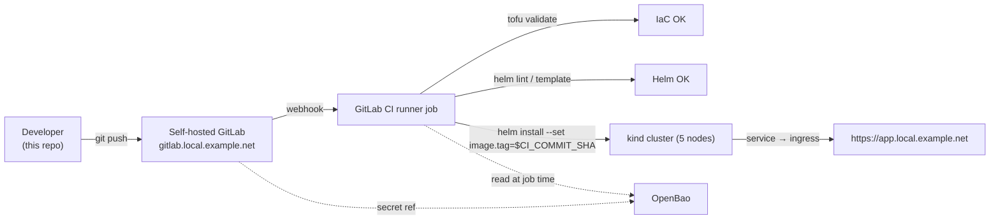

# CICD Blueprint — self-hosted GitLab in k8s + CI/CD, end to end

> One repo, one machine, agentic driven. A 5-node kind
> cluster hosts a self-managed GitLab (chart-bundled Envoy
> Gateway terminates `*.local.example.net`), a registered Runner,
> and OpenBao for secret injection. Push a commit, get a running
> workload on `https://<app>.local.example.net`.

This repo implements the GitLab + Gilab Runner + OpenBao + CI/CD templates provisioned in a local Kubernetes cluster with OpenTofu.
The templates build a GitLab CI pipeline that builds, test and deploys apps to the self-hosted Gitlab.

## What you get after running this

| What | Where to find it |
| --- | --- |
| 5-node local Kubernetes cluster (1 control-plane + 4 workers) | `kubectl get nodes` after Phase 1 |
| CloudNativePG operator + single-instance PG cluster (`postgresql-cnpg-1`), SCRAM-SHA-256 auth, chart-bundled (chart 10.x drops the bundled PG) | `kubectl -n postgresql get cluster` |
| Self-hosted GitLab CE (chart-bundled OpenBao subchart for GitLab Secrets Manager) | `https://gitlab.local.example.net` |
| GitLab Registry / KAS / MinIO object storage (LFS / artifacts / packages) | `https://{registry,kas,minio}.local.example.net` |
| Bootstrap-installed OpenBao (standalone, chart-bundled PVC, PG-backed) | `https://openbao.local.example.net` |
| Self-registered GitLab Runner (Kubernetes executor, registers against in-cluster `gitlab-webservice-default.gitlab.svc:8181` Service URL) | `Admin → CI/CD → Runners` after Phase 2 |
| Stable PV/PVC pairs for CloudNativePG/Redis/MinIO/OpenBao/Gitaly (each bound by exact PVC name + CNPG annotations on the postgresql one) | `infra/data/shared/stable/<service>/` (hostPath-backed, `Retain` policy). The chart PVCs bind to these by name so `tofu destroy && tofu apply` keeps the data — opt-in via `var.preserve_stateful_data = true` (paired with `bootstrap --destroy --preserve-data`); default is **destructive** (`tofu destroy` wipes everything via the `null_resource.wipe_data` provisioner + chart-managed `rm -rf` teardown). See `docs/phase-2.md § Stable storage` for the contract on PVC naming and CNPG annotations. |
| Wildcard cert + CA for `*.local.bruj0.net` | `infra/tls/wildcard/` (10-year self-signed, regenerated by Phase 2's cfssl Job; `--destroy` wipes it for a full reset) |
| Chart-managed Secrets snapshot | `infra/secrets/gitlab-runtime-secrets.yaml` (chart-minted postgres/redis/minio/rails/gitaly/kas passwords, mode 0600) + `infra/secrets/cnpg-role-passwords.json` (bootstrap-minted gitlab/openbao PG roles, mode 0600) — both written at the end of every successful Phase 2 install. See `docs/secrets.md` for how each secret is sourced and restored. |
| One-shot teardown (destructive) | `uv run blueprint-bootstrap --destroy [--yes] [--dry-run]` (cluster + stable/ + cert + secrets + OpenBao init JSON, with a privileged-container fallback for pod-UID-owned dirs). Add `--preserve-data` to keep the host-side stateful dirs intact (legacy 2026-06 contract; see `infra/tofu/variables.tf:preserve_stateful_data`). |
| Sample workload (guestbook) packaged as a Helm chart | `apps/guestbook/helm-chart/` |
| GitLab CI pipeline that validates and deploys | **Phase 3 — pending**. The chart is in place; the `.gitlab-ci.yml` is the next deliverable. See `docs/phase-1.md § Future` and the *Trade-offs* section below. |

The eventual pipeline is the demo: a push to a sample app
triggers a runner job that validates the OpenTofu code
(`tofu validate`), validates the Helm chart (`helm template` /
`helm lint`), and on `main` deploys the chart into the cluster,
exposing the pod through the same `*.local.example.net` wildcard
the GitLab UI already uses. Phases 1 + 2 build the platform;
Phase 3 wires the app into it.

## End-to-end narrative



In words:

1. **Phase 1 — Cluster.** OpenTofu creates a 5-node kind cluster,
   with a shared hostPath mount under `infra/data/shared/`
   (chart-managed PVCs from Phase 2 land here too).
2. **Phase 2 — Stack.** Bootstrap installs Gateway API CRDs,
   OpenBao, GitLab CE (which sub-installs Envoy Gateway and mints
   a self-signed wildcard cert for `*.local.example.net` via a
   cfssl Job), and a Runner registered against the cluster-internal
   GitLab Service URL.
3. **Phase 3 — App.** A sample app (the `guestbook` Helm chart in
   `apps/guestbook/`) is built and pushed to the in-cluster
   registry. A `.gitlab-ci.yml` validates the IaC + Helm on every
   push; on `main`, it deploys the chart to the cluster. Required
   secrets are read at job time from OpenBao.

## Prerequisites

See [docs/prereqs.md](docs/prereqs.md). The short list: Linux or
macOS, `kind` 0.27+, `kubectl`, `helm` ≥3.16, `tofu` 1.6+, `uv`
0.4+, `podman` or `docker`, ~10 GB free RAM for the cluster + GitLab.

## Quick start

### 1. Get the code

```sh
git clone https://github.com/bruj0/k8s-cicd-gitlab.git
cd k8s-cicd-gitlab
```

### 2a. Hand it to an agent (recommended)

The skills under [`.agents/skills/`](.agents/skills/) follow the
[`agentskills.io`](https://agentskills.io) open standard, which
several AI coding agents (GitHub Copilot, Cursor, Claude Code,
Codex) read directly as background context the moment the repo
is opened. For agents that don't auto-discover, paste the skill
file into the chat as a reference. The recommended loop:

1. Open the `k8s-cicd-gitlab/` folder in your AI coding agent. If the
   agent auto-loads skills (`<agent> skills` is a thing — see
   your agent's docs), the two skills are already in context.
   Otherwise paste
   [`.agents/skills/provision-phase-1/SKILL.md`](.agents/skills/provision-phase-1/SKILL.md)
   and
   [`.agents/skills/provision-gitlab/SKILL.md`](.agents/skills/provision-gitlab/SKILL.md)
   into the first message.
2. Prompt the agent:

   > Run `provision-phase-1` end to end and report when the
   > cluster's 5 nodes are Ready. Then run `provision-gitlab`
   > and report when GitLab is reachable. Don't run anything
   > that needs `sudo` — print the command and ask me to run it.
   > Follow each skill's Smoke tests section before declaring
   > green.

3. The agent reads each skill's `Pre-flight` → `Install` → `Smoke
   tests` → `Iteration loop` in order, runs the matching
   `uv run blueprint-bootstrap --phase N` command, and reads
   back the smoke-test invariants. When something fails, the
   skill's `Iteration loop` already maps the failure to the
   exact installer class to fix.
4. Review the diff (the agent should have touched only
   `infra/scripts/bootstrap/phase<N>/` or
   `infra/scripts/bootstrap/VERSIONS.json`) and commit.

Why this works: the skill files are plain Markdown, they follow
the canonical ten-section template, and the agent uses them as a
deterministic runbook (Install section → one-liner) plus a
checklist (Smoke tests section → invariants) plus a recovery
manual (Iteration loop + Common pitfalls → where to look first).
That keeps the agent on-rails even when a step fails.

### 2b. Or run it by hand

The full cluster + stack is up in four commands once prereqs are
met (see [docs/prereqs.md](docs/prereqs.md)):

```sh
# 1. Install the bootstrap's Python deps into .venv/ (the committed
#    uv.lock makes this reproducible). Idempotent.
uv sync

# 2. Bootstrap the working tree (prereqs check, tofu init, helm
#    chart cache). Also idempotent. Prints the next commands.
uv run blueprint-bootstrap --phase 1

# 3. You apply — the bootstrap never does (per spec, OpenTofu is
#    run by a person). Cluster comes up; Headlamp URL is printed.
tofu -chdir=infra/tofu apply -auto-approve

# 4. Install GitLab + Runner + OpenBao + chart-managed Envoy
#    Gateway. End-to-end takes ~10 min on a beefy laptop.
uv run blueprint-bootstrap --phase 2
```

### 3. Post-install host-side steps

Three steps the bootstrap can't do for you (all of them are
outside the cluster):

1. **Trust the chart's wildcard CA** — the GitLab chart's
   pre-install cfssl Job mints `*.local.example.net` and stores
   the CA in the `gitlab-wildcard-tls-ca` Secret; export it to
   disk and add it to the host trust store:

   ```sh
   kubectl -n gitlab get secret gitlab-wildcard-tls-ca \
     -o jsonpath='{.data.cfssl_ca}' | base64 -d > infra/tls/public/ca.crt
   sudo trust anchor infra/tls/public/ca.crt
   ```

2. **Map the wildcard to 127.0.0.1** so the browser reaches
   Envoy on the kind node:

   ```sh
   echo "127.0.0.1 gitlab.local.example.net registry.local.example.net \
                kas.local.example.net minio.local.example.net \
                openbao.local.example.net" | sudo tee -a /etc/hosts
   ```

3. **Read OpenBao secrets** via the `blueprint-secrets` CLI
   (auto-port-forwards 127.0.0.1:8200, so no `kubectl port-forward`
   is needed):

   ```sh
   uv run blueprint-secrets read gitlab initial_root_password   # GitLab root pw
   uv run blueprint-secrets ui                                  # OpenBao UI
   ```

4. **Reach in-cluster services without remembering the
   `kubectl port-forward` incantation.** The same CLI grew a
   generic dispatcher — picks the right kubeconfig, namespace,
   service, and port for you, prints what to do next, and tears
   down the forward on Ctrl-C:

   ```sh
   uv run blueprint-secrets port-forward --list                # show menu
   uv run blueprint-secrets port-forward openbao               # http://127.0.0.1:8200/ui
   uv run blueprint-secrets port-forward gitlab-registry       # docker login 127.0.0.1:5000
   uv run blueprint-secrets port-forward minio                 # S3 API + console hints
   uv run blueprint-secrets port-forward gitlab-webservice     # curl http://127.0.0.1:8181/-/health
   ```

   The cluster's intended user-facing path is the Gateway/NodePort
   pair (browser → `https://gitlab.<domain>`) — see step 2 above.
   `port-forward` is the cluster-side workhorse for things the
   Gateway doesn't (yet) expose (e.g. Container Registry's plain
   HTTP v2 endpoint on `127.0.0.1:5000`).

Full details for each phase are in
[docs/phase-1.md](docs/phase-1.md) and [docs/phase-2.md](docs/phase-2.md).
At that point you have a working cluster, GitLab, Runner, and
OpenBao — the platform Phase 3 will deploy the sample app into.
Phase 3 itself is the upcoming work (the chart at
`apps/guestbook/helm-chart/` is ready; the `.gitlab-ci.yml` is the
next deliverable; the assignment's `run.sh` — listed under
`devops-take-home.md` Deliverables — is also upcoming work).

Manual verification (if you went the hand-driven path): run each
skill's *Smoke tests* section step by step. If you handed the
repo to an agent, the agent already did this — just read its
final report and the smoke-test output it captured.

The full URLs and login credentials after each phase are
maintained in the per-phase skills so they don't drift:

- Phase 1 (cluster + Headlamp):
  [`.agents/skills/provision-phase-1/SKILL.md`](.agents/skills/provision-phase-1/SKILL.md)
- Phase 2 (GitLab + Runner + OpenBao):
  [`.agents/skills/provision-gitlab/SKILL.md`](.agents/skills/provision-gitlab/SKILL.md)

## Iteration loop

Both phases are idempotent. The bootstrap's job is to leave you
in a clean "everything is verified" state — when something is
off, the right move is:

1. Read the smoke test in the corresponding skill
   (`provision-phase-1` or `provision-gitlab`). Both skills
   enumerate the checkable invariants.
2. Find the matching installer under
   `infra/scripts/bootstrap/phase<N>/`. Each installer is a
   single-responsibility class with a one-line `__init__` that
   takes the paths and version catalog it needs.
3. Fix the installer (or the YAML reference under
   `bootstrap/phase2/references/`), re-run the bootstrap.
4. Update [AGENTS.md](AGENTS.md) if the rule you tripped over
   should be a hard rule, and commit the docs in the same PR as
   the code fix.

### Wiping the cluster + Phase 2 state

The bootstrap ships a one-shot teardown that wipes **both** the
infrastructure layer (the kind cluster, the kubeconfig) and
the bootstrap-owned host-side state (`infra/data/shared/stable/`
hostPath PV backing dirs, chart-managed leftovers, the
chart-managed Secrets snapshot, the wildcard TLS cert + CA,
OpenBao's init JSON):

```sh
uv run blueprint-bootstrap --destroy --yes          # default: full wipe
uv run blueprint-bootstrap --destroy --preserve-data  # opt-out: keep stateful data
uv run blueprint-bootstrap --destroy --dry-run      # print only
```

**Default contract (2026-07+): `tofu destroy` wipes everything.**
The bootstrap's `--destroy` runs `tofu destroy` (cluster
lifecycle is owned by OpenTofu; see `AGENTS.md § 4 rule #3`),
and the cluster's `null_resource.wipe_data` destroy
provisioner (in `infra/tofu/cluster.tf`) sweeps
`infra/data/shared/` as part of `tofu destroy`. Paired with
local-path-provisioner's default `rm -rf` teardown, the result
is: cluster gone, every PV gone, every host-side data dir gone.
A fresh `bootstrap --phase 2` rebuilds from scratch.

**Bidirectional mode** (opt-in, paired with the cluster-apply
side):
```sh
tofu -chdir=infra/tofu apply -var=preserve_stateful_data=true
uv run blueprint-bootstrap --destroy --preserve-data
```

The two flags must agree — `tofu destroy` reads the var, and the
cluster's `null_resource.wipe_data` destroy provisioner
short-circuits to a no-op when the var is `true`. The kind
`extra_mounts.propagation` field also flips from
`Bidirectional` to default `HostToContainer` under the same var
so the host bind-source isn't propagated through on container
umount. Useful for users who want to recreate the cluster but
reuse the on-disk PG / Redis / MinIO / OpenBao / Gitaly data.
Note: chart-minted fresh credentials won't match stale on-disk
PG unless the chart-managed Secrets snapshot
(`infra/secrets/gitlab-runtime-secrets.yaml`) is also preserved
(passing `--preserve-data` keeps it).

If a PV dir is owned by a pod UID (e.g. `openbao` runs as UID
100, `postgres` as UID 1001) and the unprivileged `rm` fails,
`bootstrap --destroy` falls back to a one-shot Docker/Podman
privileged container that bind-mounts the parent dir and
`rm -rf`'s the child. Same trick the `null_resource.wipe_data`
provisioner uses on the tofu side.

The **only** way to create the cluster is `tofu -chdir=infra/tofu
apply -auto-approve`. `--destroy` only tears down; it never
re-creates.

## How the bootstrap + skills fit together

Two tools drive this repo, and they play different roles:

### The bootstrap application (`infra/scripts/bootstrap/`)

A single uv-managed Python package that does the actual work.

```
infra/scripts/
├── bootstrap.py                 # thin shim → delegates to bootstrap/
└── bootstrap/                   # the package (installed by uv sync)
    ├── __main__.py              # python -m bootstrap → same entry as the console script
    ├── VERSIONS.json            # pinned versions, single source of truth
    ├── cli.py                   # click wrapper → blueprint-bootstrap entry point
    │                           # + `--destroy` / `--port-forward` / `--dry-run` / `--user`
    ├── secrets_cli.py           # click wrapper → blueprint-secrets entry point
    ├── app.py                   # composition root: BootstrapApp wires phases → installers
    ├── prereq.py                # Phase 1 prereq check + installer
    ├── helm_cache.py            # downloads charts into infra/helm-charts/
    ├── tofu.py                  # tofu init / plan / validate (read-only ops)
    ├── paths.py                 # resolved Path constants (chart dir, secrets dir, infra/tls/)
    ├── os_detect.py             # apt / dnf / pacman / brew branching
    ├── shell.py                 # idempotent subprocess wrapper (logs every command)
    ├── logger.py, versions.py, installer.py
    └── phase2/                  # Phase 2 only — 13 steps orchestrated by Phase2Pipeline
        ├── pipeline.py          # orchestrates the 13 Phase 2 steps in order
        ├── catalog.py           # Phase2Installers dataclass (bundle of every installer)
        ├── gateway.py           # Gateway API CRDs (standard v1.5.0 + chart-shipped Envoy CRDs)
        ├── local_path_provisioner.py  # local-path StorageClass + `local-path` as default
        ├── stable_storage.py    # pre-create stable PV/PVC pairs (existing_claim /
        │                        # volume_claim_template / pvc_with_volume_name); also stamps
        │                        # CNPG-specific PVC name (`<cluster>-<serial>`) + annotations
        ├── cloudnative_pg.py    # CNPG operator + Cluster/postgresql-cnpg (single instance, 8Gi)
        │                        # + bootstrap `gitlabhq_production` + `openbao` PG databases
        ├── redis.py             # bitnami/redis single-node (architecture=standalone)
        ├── minio.py             # MinIO single-node + 11 GitLab buckets + the dual-key
        │                        # `gitlab-rails-storage` Secret (Rails `connection` +
        │                        # Docker-registry native `config` for the registry s3 driver)
        ├── openbao.py           # OpenBao chart install + init + unseal (PG backend)
        ├── wildcard_certs.py    # mint self-signed CA + wildcard cert + 4 listener Secrets
        ├── persistent_secrets.py # snapshot + restore chart-managed Secrets (postgres/redis/
        │                        # minio/rails/gitaly/kas) so `tofu destroy && apply` works
        ├── gitlab.py            # GitLab chart install (chart 10.x bundles Envoy Gateway +
        │                        # OpenBao subchart; consumes external PG/Redis/MinIO)
        ├── runner.py            # Runner chart install, registers against in-cluster
        │                        # `gitlab-webservice-default.gitlab.svc:8181` over HTTP
        ├── secrets.py           # hvac client (OpenBao) + lazy shared port-forward
        └── references/          # vendored CRDs, CNPG Cluster, chart fragments
```

After `uv sync`, two console scripts land on the per-checkout
`$PATH`:

| Script | Wraps | Purpose |
| --- | --- | --- |
| `blueprint-bootstrap` | `bootstrap.cli:main` | The installer (`--phase 1 \| 2`, `--check`, `--dry-run`, `--user`). |
| `blueprint-secrets`  | `bootstrap.secrets_cli:main` | Post-install helper: `read <path> <key>`, `ui` (OpenBao), and `port-forward <service>` (any in-cluster Service — auto-locates the tofu kubeconfig + namespace + port). |

`BootstrapApp` (in `app.py`) is the composition root: it instantiates
each *installer* — a single-responsibility class that takes only
the paths and version catalog it needs — and runs them in order.
That's the SOLID shape: appending "another installer for Phase 3"
means adding one class under `phase3/`, one wiring line in `app.py`,
and (if exposed via CLI) one click option in `cli.py`. No installer
ever depends on another.

The hard constraint: the bootstrap **prepares**, it never
**applies**. There is no `--apply` flag. The cluster comes up
only when a person runs `tofu -chdir=infra/tofu apply`. That
boundary is documented in `AGENTS.md § 4 rule #3`.

### The skills (`.agents/skills/`)

Two per-phase `SKILL.md` files, one per phase. They follow the
[`agentskills.io` open standard](https://agentskills.io), so they
work as background context for any AI coding agent (Copilot, Claude,
Cursor, etc.) and as plain runbooks for humans. Each skill has the
same ten sections, in the same order:

```
1.  Pre-flight                       # what to verify before starting
2.  Install                          # the actual install one-liner
3.  Smoke tests                      # the checkable invariants + how to read them
4.  URLs you can reach after install # the exact hostnames + logins
5.  Iteration loop                   # when something is off, what to read + re-run
6.  Canonical (known-good) pinned versions
7.  Common pitfalls (frozen — append, don't rewrite)
8.  Rules of thumb (apply when adding Phase-N pieces)
9.  When the install is green        # the exact "you're done" output
10. How to undo                      # the symmetric teardown
```

The section names vary slightly per phase (the Phase 2 skill has
two *Rules of thumb* sections because Phase 2 touches multiple
charts; the Phase 1 skill has one). The shape is the same, and
both skills title the smoke-test section "Smoke tests" — that's
the one to read first when something is off.

The two skills shipped here:

| Skill | Drives | Reads from |
| --- | --- | --- |
| [`.agents/skills/provision-phase-1/`](.agents/skills/provision-phase-1/) | `blueprint-bootstrap --phase 1` + the six `tofu apply`-style handoff commands | `bootstrap/prereq.py`, `bootstrap/helm_cache.py`, `bootstrap/tofu.py`, Headlamp chart cache |
| [`.agents/skills/provision-gitlab/`](.agents/skills/provision-gitlab/) | `blueprint-bootstrap --phase 2` + the three post-install host-side steps (trust CA, /etc/hosts, `blueprint-secrets`) | `bootstrap/phase2/pipeline.py` + `gateway.py` / `openbao.py` / `gitlab.py` / `runner.py` / `secrets.py` |

### How they relate

The skills are **driving instructions**; the bootstrap is the
**machine that executes them**:

- A skill tells *what* to do and *how to verify* — it points at
  the exact installer class to read, the exact smoke test to
  run, the exact URL to open.
- `uv run blueprint-bootstrap --phase N` does the work — it
  pre-flights, installs, and prints the next user command.
- The skill is for AI agents and humans alike; the bootstrap is
  for both shells to call.

Concrete example, Phase 2:

1. The user (or an AI agent) reads `.agents/skills/provision-gitlab/SKILL.md`.
2. The skill's *Install* section says: `uv run blueprint-bootstrap --phase 2`.
3. `bootstrap.cli:main` parses the flag, instantiates `BootstrapApp`,
   which wires together `Phase2Pipeline` → `GatewayCRDsInstaller`
   → `OpenBaoInstaller` → `GitlabInstaller` → `GitLabRunnerInstaller`.
4. Each installer reads `VERSIONS.json`, calls the injected
   `CommandRunner` for the `helm`/`kubectl` command, and logs
   the output under its own logger. (`CommandRunner` is the
   idempotent subprocess Protocol in `shell.py` — every shell
   call is logged with `--dry-run` honoured.)
5. The skill's *Smoke tests* section walks the user through
   verifying each step (5 Envoy pods Running, Gateway
   Programmed=True, runner registered, OpenBao has secrets,
   GitLab UI returns 200).
6. The skill's *Iteration loop* maps a failed smoke test to the
   exact installer + line range to inspect, so a fix becomes
   "edit one class, re-run the bootstrap."

When a phase lands, it's expected to grow one new installer
class under `phase<N>/`, one new entry in `BootstrapApp`, and
(if user-facing) one new section in the skill — not a parallel
class hierarchy and not a new top-level command.

## Layout

```
blueprint/
├── apps/             # Application repositories (one per workload)
│   ├── guestbook/    # Demo: classic k8s guestbook (Phase 3 — chart + CI)
│   ├── redis/        # Demo: redis master
│   └── redis-slave/  # Demo: redis slave workload
├── docs/             # Per-phase runbooks + prereqs
│   ├── prereqs.md
│   ├── phase-1.md    # Cluster bring-up runbook
│   └── phase-2.md    # GitLab + Runner + OpenBao contributor guide
├── pyproject.toml    # uv project: installs blueprint-bootstrap + blueprint-secrets
├── uv.lock           # committed for reproducibility
├── AGENTS.md         # Hard rules + layout map for AI agents and humans
└── infra/
    ├── helm-charts/  # Locally-cached helm charts (GitLab, Runner, OpenBao, Headlamp, …)
    ├── scripts/
    │   ├── bootstrap.py  # thin shim → delegates to bootstrap/ package
    │   └── bootstrap/    # class-based pipeline (SOLID), packaged via pyproject.toml
    │       ├── VERSIONS.json  # Pinned versions, single source of truth
    │       ├── cli.py          # click wrapper: blueprint-bootstrap entry point
    │       ├── secrets_cli.py  # click wrapper: blueprint-secrets (post-install helper)
    │       ├── app.py          # composition root
    │       └── phase<N>/       # Phase-specific installers
    └── tofu/         # OpenTofu configuration (kind cluster)
```

(`infra/tls/` is fully gitignored except for `.gitkeep`. It's a
scratch dir used as a one-shot export target for the GitLab
chart's cfssl Job — Phase 2's post-install step exports the CA
there before adding it to the host trust store.)

## Conventions

These are the rules-of-thumb encoded in [`AGENTS.md`](AGENTS.md).
The hard rules (cluster lifecycle is `tofu` only, no edits to
shipped charts, no commits of secrets) live there and matter for
both humans and AI agents touching this repo.

- **Bootstrap prepares, never applies.** Per spec, the bootstrap
  application verifies the system and provisions all the
  configuration so a person can run `tofu apply` themselves.
  There is no `--apply` flag on the bootstrap.
- **No shell scripts for non-trivial logic.** The spec rules shell
  out for Python. `infra/scripts/bootstrap/` is a class-based
  package composed of single-responsibility classes wired
  together by `app.py`.
- **uv is the Python toolchain.** `pyproject.toml` + `uv.lock` are
  committed; `.venv/` is gitignored. Two console scripts:
  `blueprint-bootstrap` (install) and `blueprint-secrets`
  (post-install OpenBao helper). Don't reintroduce system-level
  `pip install`.
- **Versions in one place.** `infra/scripts/bootstrap/VERSIONS.json`
  pins every tool, every helm chart, every chart repo URL. No
  class hardcodes a version — they all read from the catalog.
- **Helm charts are cached locally.** Charts land in
  `infra/helm-charts/<name>-<version>.tgz`; the bootstrap installs
  them from that path so re-installs don't require a network
  round-trip.
- **No plaintext secrets in git.** Phase 2 stores the OpenBao
  unseal keys + root token in `infra/secrets/openbao-init.json`
  (gitignored, mode 0600) and the bootstrap-minted PG role
  passwords in `infra/secrets/cnpg-role-passwords.json`. The
  chart-minted postgres/redis/minio/rails/gitaly/kas passwords
  are snapshotted to `infra/secrets/gitlab-runtime-secrets.yaml`.
  The values that the developer needs day-to-day (GitLab initial
  root password, Runner registration token) are pushed into
  OpenBao at `secret/gitlab/...`. Read them back via
  `uv run blueprint-secrets read <path> <key>`. The full secret
  inventory is in [`docs/secrets.md`](docs/secrets.md).
- **TLS is local-CA now, LE later.** Public LE can't validate
  `*.local.example.net`. The GitLab chart's pre-install cfssl Job
  mints the wildcard cert for us today; once public DNS is
  delegated, swap to cert-manager-issued certs without changing
  anything about the bootstrap or the chart values.
- **CNPG PVC contract.** The CloudNativePG operator looks up the
  pre-created PVC by `metadata.controller` UID. The PVC name MUST
  be `<cluster>-<serial>` (i.e. `postgresql-cnpg-1` for a single
  instance). The PVC MUST carry CNPG annotations (`cnpg.io/cluster`,
  `cnpg.io/instanceName`, `cnpg.io/instanceRole=primary`,
  `cnpg.io/nodeSerial=1`, `cnpg.io/pvcRole=main`). `bootstrap.py
  --phase 2` enforces both via `phase2/stable_storage.py` and
  re-stamps the `ownerReference` after Cluster creation so the
  field-index selector picks the volume up. See
  [`docs/phase-2.md`](docs/phase-2.md) § *Stable storage* for the
  full contract.
- **GitLab-rails-storage Secret carries two keys, not one.** The
  Docker-registry s3 driver and the Rails-side object_store
  parsers want different YAML schemas for the same MinIO bucket.
  The chart's registry subchart reads `registry.storage.key`
  (default `config`) and mounts that into the `storage:` block of
  `/etc/docker/registry/config.yml`; the Rails-side readers
  (`appConfig.object_store.*.connection`) read the key
  `connection`. Both keys live on a single Secret named
  `gitlab-rails-storage`. Don't merge them.
- **The Runner registers in-cluster, not via the public hostname.**
  Pods that need to register against GitLab use
  `http://gitlab-webservice-default.gitlab.svc:8181`, never
  `https://gitlab.local.bruj0.net`. Port 8181 speaks plain HTTP
  (TLS terminates at the Gateway above it).

## Trade-offs and what we'd do with more time

These are the calls we made deliberately — they're the questions
a reviewer is most likely to ask.

- **Why OpenTofu and not Terraform.**  OpenTofu is the OSS fork and the prereqs installer
  covers both apt/dnf/pacman/brew.
- **Why kind and not minikube/k3d.** kind's per-container
  hostPath mounts (used for the per-node + shared volumes in
  Phase 1) are the cleanest way to model a multi-node cluster on
  one host. minikube's mount story is VM-shaped; k3d is closer
  but shipped with fewer workers per control-plane out of the box.
- **Why the GitLab chart instead of GitLab Omnibus.** The chart
  is what the GitLab project itself ships as the reference for
  running GitLab inside Kubernetes; the chart also bundles Envoy
  Gateway as `gateway-helm` sub-chart, so the same wildcard cert
  handles GitLab, the Registry, KAS, MinIO, and (Phase 3) the
  deployed app.
- **Why Phase 2 ships one Runner (executor), not a fleet.** A single executor inside the
  cluster is enough for the validation + deploy jobs.
- **Why a runner-in-pod and not a shell executor.** The runner is
  registered with `kubernetes` executor; jobs spin up ephemeral
  pods. That keeps CI workloads inside the same RBAC boundary as
  the workload they deploy, no host-mount leakage.
- **Tradeoff on local-network state.** `*.local.example.net`
  resolves on the developer host via `/etc/hosts`, not on the
  cluster. Pods use Service DNS
  (`gitlab-webservice-default.gitlab.svc:8181`,
  `openbao.openbao.svc:8200`) for in-cluster traffic. The
  distinction is encoded as a rule in `AGENTS.md` so future
  contributors don't paper over it with a clever alias.
- **What we'd do with more time.**
  1. Move TLS to cert-manager +
  Let's Encrypt once a real DNS name is delegated.
  2. ~~Add a `dispose` subcommand~~ (done: `blueprint-bootstrap
     --destroy [--yes] [--dry-run]` — wipes cluster + stable/ +
     chart-managed Secrets snapshot + wildcard cert + OpenBao
     init JSON. Privilege container fallback for pod-UID-owned
     PV dirs.)
  3. Wire the chart cache into Helm's OCI
  cache (`helm pull --untar`) so we don't re-download on every
  re-run when `VERSIONS.json` bumps.
  4. Promote Phase 2's chart-managed Secrets snapshot
     (`gitlab-runtime-secrets.yaml`) from
     `--destroy --yes` reset to an opt-in `--preserve` mode so
     `tofu destroy && tofu apply && bootstrap --phase 2`
     preserves GitLab users / repos / CI variables across the
     cluster recreate — the snapshot mechanism is already in
     place, just needs a `--no-wipe-stable` flag. 
 