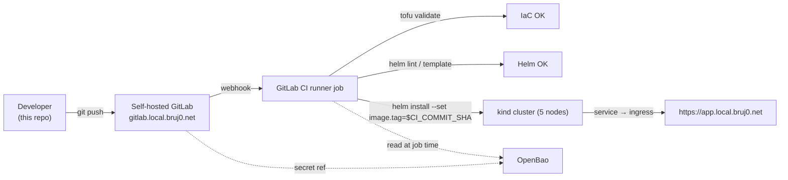

# Blueprint — self-hosted GitLab + k8s + CI/CD, end to end

> One repo, one machine, one running pipeline. A 5-node kind
> cluster hosts a self-managed GitLab (chart-bundled Envoy
> Gateway terminates `*.local.bruj0.net`), a registered Runner,
> and OpenBao for secret injection. Push a commit, get a running
> workload on `https://<app>.local.bruj0.net`.

This repo implements the local GitLab + k8s + CI/CD assignment
described in [`../devops-take-home.md`](../devops-take-home.md) and
[`../spec.md`](../spec.md): provision a local Kubernetes cluster with
OpenTofu, build a GitLab CI pipeline that validates the IaC and a
Helm chart, and deploy a small application end to end on
self-hosted GitLab with its own Runner.

## What you (the reviewer) get after running this

| What | Where to find it |
| --- | --- |
| 5-node local Kubernetes cluster (1 control-plane + 4 workers) | `kubectl get nodes` after Phase 1 |
| Self-hosted GitLab CE | `https://gitlab.local.bruj0.net` |
| Self-registered GitLab Runner (executes CI on the same cluster) | `Admin → CI/CD → Runners` after Phase 2 |
| Container Registry, KAS, MinIO (LFS/artifacts/packages) | `https://{registry,kas,minio}.local.bruj0.net` |
| OpenBao (KV v2 secret store) | `https://openbao.local.bruj0.net` |
| Sample workload (guestbook) packaged as a Helm chart | `apps/guestbook/helm-chart/` |
| GitLab CI pipeline that validates and deploys | **Phase 3 — pending**. The chart is in place; the `.gitlab-ci.yml` is the next deliverable. See `docs/phase-1.md § Future` and the *Trade-offs* section below. |

The eventual pipeline is the demo: a push to a sample app
triggers a runner job that validates the OpenTofu code
(`tofu validate`), validates the Helm chart (`helm template` /
`helm lint`), and on `main` deploys the chart into the cluster,
exposing the pod through the same `*.local.bruj0.net` wildcard
the GitLab UI already uses. Phases 1 + 2 build the platform;
Phase 3 wires the app into it.

## End-to-end narrative



In words:

1. **Phase 1 — Cluster.** OpenTofu creates a 5-node kind cluster,
   with per-node + shared hostPath mounts under `infra/data/`.
2. **Phase 2 — Stack.** Bootstrap installs Gateway API CRDs,
   OpenBao, GitLab CE (which sub-installs Envoy Gateway and mints
   a self-signed wildcard cert for `*.local.bruj0.net` via a
   cfssl Job), and a Runner registered against the cluster-internal
   GitLab Service URL.
3. **Phase 3 — App.** A sample app (the `guestbook` Helm chart in
   `apps/guestbook/`) is built and pushed to the in-cluster
   registry. A `.gitlab-ci.yml` validates the IaC + Helm on every
   push; on `main`, it deploys the chart to the cluster. Required
   secrets are read at job time from OpenBao.

## Prerequisites

See [docs/prereqs.md](docs/prereqs.md). The short list: Linux or
macOS, `kind` 0.27+, `kubectl`, `helm` ≥3.16, `tofu` 1.6+, `uv`
0.4+, `podman` or `docker`, ~10 GB free RAM for the cluster + GitLab.

## Quick start (the short version)

The full cluster + stack is up in three commands once prereqs are
met:

```sh
cd blueprint

# 1. One-time: bootstrap the working tree (prereqs install, tofu init,
#    helm chart cache). Idempotent.
uv sync
uv run blueprint-bootstrap --phase 1

# 2. You apply — the bootstrap never does (per spec, OpenTofu is
#    run by a person). Cluster comes up; Headlamp URL is printed.
tofu -chdir=infra/tofu apply -auto-approve

# 3. Install GitLab + Runner + OpenBao + chart-managed Envoy
#    Gateway. End-to-end takes ~10 min on a beefy laptop.
uv run blueprint-bootstrap --phase 2
```

Follow the four post-install host-side steps printed by the
bootstrap: trust the chart's wildcard CA, add the `*.local.bruj0.net`
mapping to `/etc/hosts`, fetch the OpenBao root token, and visit
the UI to set the GitLab root password. Full details are in
[docs/phase-1.md](docs/phase-1.md) and [docs/phase-2.md](docs/phase-2.md).

Then verify with the smoke tests in the matching skills, and at that
point you have a working cluster, GitLab, Runner, and OpenBao —
the platform Phase 3 will deploy the sample app into. Phase 3
itself is the upcoming work (the chart at `apps/guestbook/helm-chart/`
is ready; the `.gitlab-ci.yml` is the next deliverable; the
assignment's `run.sh` — listed under `devops-take-home.md`
Deliverables — is also upcoming work).

The full URLs and login credentials after each phase are
maintained in the per-phase skills so they don't drift:

- Phase 1 (cluster + Headlamp):
  [`.agents/skills/provision-phase-1/SKILL.md`](.agents/skills/provision-phase-1/SKILL.md)
- Phase 2 (GitLab + Runner + OpenBao):
  [`.agents/skills/provision-gitlab/SKILL.md`](.agents/skills/provision-gitlab/SKILL.md)

## Iteration loop

Both phases are idempotent. The bootstrap's job is to leave you
in a clean "everything is verified" state — when something is
off, the right move is:

1. Read the smoke test in the corresponding skill
   (`provision-phase-1` or `provision-gitlab`). Both skills
   enumerate the checkable invariants.
2. Find the matching installer under
   `infra/scripts/bootstrap/phase<N>/`. Each installer is a
   single-responsibility class with a one-line `__init__` that
   takes the paths and version catalog it needs.
3. Fix the installer (or the YAML reference under
   `bootstrap/phase2/references/`), re-run the bootstrap.
4. Update [AGENTS.md](AGENTS.md) if the rule you tripped over
   should be a hard rule, and commit the docs in the same PR as
   the code fix.

There's no separate "destroy" script — the only way to create or
delete the cluster is `tofu -chdir=infra/tofu {apply,destroy}`.
That rule is enforced as `AGENTS.md § 4 rule #3`.

## Layout

```
blueprint/
├── apps/             # Application repositories (one per workload)
│   ├── guestbook/    # Demo: classic k8s guestbook (Phase 3 — chart + CI)
│   ├── redis/        # Demo: redis master
│   └── redis-slave/  # Demo: redis slave workload
├── docs/             # Per-phase runbooks + prereqs
│   ├── prereqs.md
│   ├── phase-1.md    # Cluster bring-up runbook
│   └── phase-2.md    # GitLab + Runner + OpenBao contributor guide
├── pyproject.toml    # uv project: installs blueprint-bootstrap + blueprint-secrets
├── uv.lock           # committed for reproducibility
├── AGENTS.md         # Hard rules + layout map for AI agents and humans
└── infra/
    ├── helm-charts/  # Locally-cached helm charts (GitLab, Runner, OpenBao, Headlamp, …)
    ├── scripts/
    │   ├── bootstrap.py  # thin shim → delegates to bootstrap/ package
    │   └── bootstrap/    # class-based pipeline (SOLID), packaged via pyproject.toml
    │       ├── VERSIONS.json  # Pinned versions, single source of truth
    │       ├── cli.py          # click wrapper: blueprint-bootstrap entry point
    │       ├── secrets_cli.py  # click wrapper: blueprint-secrets (post-install helper)
    │       ├── app.py          # composition root
    │       └── phase<N>/       # Phase-specific installers
    └── tofu/         # OpenTofu configuration (kind cluster)
```

(`infra/tls/` is fully gitignored except for `.gitkeep`. It's a
scratch dir used as a one-shot export target for the GitLab
chart's cfssl Job — Phase 2's post-install step exports the CA
there before adding it to the host trust store.)

## Conventions

These are the rules-of-thumb encoded in [`AGENTS.md`](AGENTS.md).
The hard rules (cluster lifecycle is `tofu` only, no edits to
shipped charts, no commits of secrets) live there and matter for
both humans and AI agents touching this repo.

- **Bootstrap prepares, never applies.** Per spec, the bootstrap
  application verifies the system and provisions all the
  configuration so a person can run `tofu apply` themselves.
  There is no `--apply` flag on the bootstrap.
- **No shell scripts for non-trivial logic.** The spec rules shell
  out for Python. `infra/scripts/bootstrap/` is a class-based
  package composed of single-responsibility classes wired
  together by `app.py`.
- **uv is the Python toolchain.** `pyproject.toml` + `uv.lock` are
  committed; `.venv/` is gitignored. Two console scripts:
  `blueprint-bootstrap` (install) and `blueprint-secrets`
  (post-install OpenBao helper). Don't reintroduce system-level
  `pip install`.
- **Versions in one place.** `infra/scripts/bootstrap/VERSIONS.json`
  pins every tool, every helm chart, every chart repo URL. No
  class hardcodes a version — they all read from the catalog.
- **Helm charts are cached locally.** Charts land in
  `infra/helm-charts/<name>-<version>.tgz`; the bootstrap installs
  them from that path so re-installs don't require a network
  round-trip.
- **No plaintext secrets in git.** Phase 2 stores the OpenBao
  unseal keys + root token in `infra/secrets/openbao-init.json`
  (gitignored, mode 0600) and pushes the values that matter
  (GitLab initial root password, Runner registration token) into
  OpenBao at `secret/gitlab/...`. Read them back via
  `uv run blueprint-secrets read <path> <key>`.
- **TLS is local-CA now, LE later.** Public LE can't validate
  `*.local.bruj0.net`. The GitLab chart's pre-install cfssl Job
  mints the wildcard cert for us today; once public DNS is
  delegated, swap to cert-manager-issued certs without changing
  anything about the bootstrap or the chart values.

## Trade-offs and what we'd do with more time

These are the calls we made deliberately — they're the questions
a reviewer is most likely to ask.

- **Why OpenTofu and not Terraform.** Assignment asked for one or
  the other; OpenTofu is the OSS fork and the prereqs installer
  covers both apt/dnf/pacman/brew.
- **Why kind and not minikube/k3d.** kind's per-container
  hostPath mounts (used for the per-node + shared volumes in
  Phase 1) are the cleanest way to model a multi-node cluster on
  one host. minikube's mount story is VM-shaped; k3d is closer
  but shipped with fewer workers per control-plane out of the box.
- **Why the GitLab chart instead of GitLab Omnibus.** The chart
  is what the GitLab project itself ships as the reference for
  running GitLab inside Kubernetes; the chart also bundles Envoy
  Gateway as `gateway-helm` sub-chart, so the same wildcard cert
  handles GitLab, the Registry, KAS, MinIO, and (Phase 3) the
  deployed app.
- **Why Phase 2 ships one Runner (executor), not a fleet.** Same
  reasoning the assignment implies — a single executor inside the
  cluster is enough for the validator + deploy jobs.
- **Why a runner-in-pod and not a shell executor.** The runner is
  registered with `kubernetes` executor; jobs spin up ephemeral
  pods. That keeps CI workloads inside the same RBAC boundary as
  the workload they deploy, no host-mount leakage.
- **Tradeoff on local-network state.** `*.local.bruj0.net`
  resolves on the developer host via `/etc/hosts`, not on the
  cluster. Pods use Service DNS
  (`gitlab-webservice-default.gitlab.svc:8181`,
  `openbao.openbao.svc:8200`) for in-cluster traffic. The
  distinction is encoded as a rule in `AGENTS.md` so future
  contributors don't paper over it with a clever alias.
- **What we'd do with more time.** (1) Move TLS to cert-manager +
  Let's Encrypt once a real DNS name is delegated. (2) Add a
  `dispose` subcommand to `blueprint-bootstrap` that runs the
  reverse of every phase (`helm uninstall → tofu destroy`) with a
  confirmation prompt. (3) Wire the chart cache into Helm's OCI
  cache (`helm pull --untar`) so we don't re-download on every
  re-run when `VERSIONS.json` bumps. (4) Replace the in-cluster
  MinIO with object storage fronted by the same wildcard. (5) Add
  a real `step-ca` or `cfssl`-as-a-Service for the wildcard,
  outside the chart, so we can re-issue without nuking GitLab.
